# 시퀀스 다이어그램

## 브랜드 & 상품

### [브랜드 정보 조회]

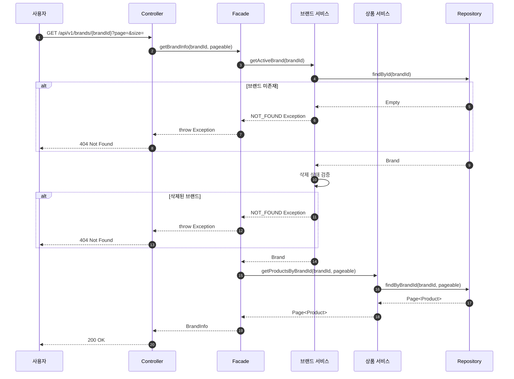
```mermaid
sequenceDiagram
    autonumber
    participant Client as 사용자
    participant Controller
    participant Facade
    participant BrandService as 브랜드 서비스
    participant ProductService as 상품 서비스
    participant Repository

    Client->>Controller: GET /api/v1/brands/{brandId}?page=&size=
    Controller->>Facade: getBrandInfo(brandId, pageable)
    Facade->>BrandService: getActiveBrand(brandId)
    BrandService->>Repository: findById(brandId)

    alt 브랜드 미존재
        Repository-->>BrandService: Empty
        BrandService-->>Facade: NOT_FOUND Exception
        Facade-->>Controller: throw Exception
        Controller-->>Client: 404 Not Found
    end

    Repository-->>BrandService: Brand
    BrandService->>BrandService: 삭제 상태 검증

    alt 삭제된 브랜드
        BrandService-->>Facade: NOT_FOUND Exception
        Facade-->>Controller: throw Exception
        Controller-->>Client: 404 Not Found
    end

    BrandService-->>Facade: Brand
    Facade->>ProductService: getProductsByBrandId(brandId, pageable)
    ProductService->>Repository: findByBrandId(brandId, pageable)
    Repository-->>ProductService: Page<Product>
    ProductService-->>Facade: Page<Product>
    Facade-->>Controller: BrandInfo
    Controller-->>Client: 200 OK
```

### [상품 목록 조회]

```mermaid
sequenceDiagram
    autonumber
    participant Client as 사용자
    participant Controller
    participant Facade
    participant ProductService as 상품 서비스
    participant CategoryService as 카테고리 서비스
    participant Repository

    Client->>Controller: GET /api/v1/products?categoryId=&keyword=&sort=&page=&size=
    Controller->>Facade: getProducts(categoryId, keyword, sort, pageable)

    opt 카테고리 필터 존재
        Facade->>CategoryService: validateCategory(categoryId)
        CategoryService->>Repository: existsById(categoryId)

        alt 카테고리 미존재
            Repository-->>CategoryService: false
            CategoryService-->>Facade: NOT_FOUND Exception
            Facade-->>Controller: throw Exception
            Controller-->>Client: 404 Not Found
        end
    end

    Facade->>ProductService: getProducts(categoryId, keyword, sort, pageable)
    ProductService->>Repository: findProducts(조건)
    Note over Repository: 삭제된 상품 제외
    Repository-->>ProductService: Page<Product>
    ProductService-->>Facade: Page<Product>
    Facade-->>Controller: Page<ProductInfo>
    Controller-->>Client: 200 OK
```

### [상품 정보 조회]

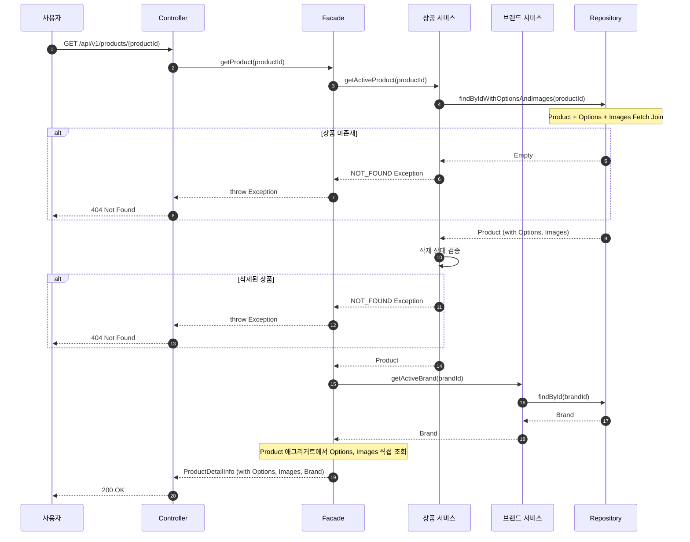
```mermaid
sequenceDiagram
    autonumber
    participant Client as 사용자
    participant Controller
    participant Facade
    participant ProductService as 상품 서비스
    participant BrandService as 브랜드 서비스
    participant Repository

    Client->>Controller: GET /api/v1/products/{productId}
    Controller->>Facade: getProduct(productId)
    Facade->>ProductService: getActiveProduct(productId)
    ProductService->>Repository: findByIdWithOptionsAndImages(productId)
    Note over Repository: Product + Options + Images Fetch Join

    alt 상품 미존재
        Repository-->>ProductService: Empty
        ProductService-->>Facade: NOT_FOUND Exception
        Facade-->>Controller: throw Exception
        Controller-->>Client: 404 Not Found
    end

    Repository-->>ProductService: Product (with Options, Images)
    ProductService->>ProductService: 삭제 상태 검증

    alt 삭제된 상품
        ProductService-->>Facade: NOT_FOUND Exception
        Facade-->>Controller: throw Exception
        Controller-->>Client: 404 Not Found
    end

    ProductService-->>Facade: Product
    Facade->>BrandService: getActiveBrand(brandId)
    BrandService->>Repository: findById(brandId)
    Repository-->>BrandService: Brand
    BrandService-->>Facade: Brand
    Note over Facade: Product 애그리거트에서 Options, Images 직접 조회
    Facade-->>Controller: ProductDetailInfo (with Options, Images, Brand)
    Controller-->>Client: 200 OK
```

---

## 브랜드 & 상품 ADMIN

### [등록된 브랜드 목록 조회]

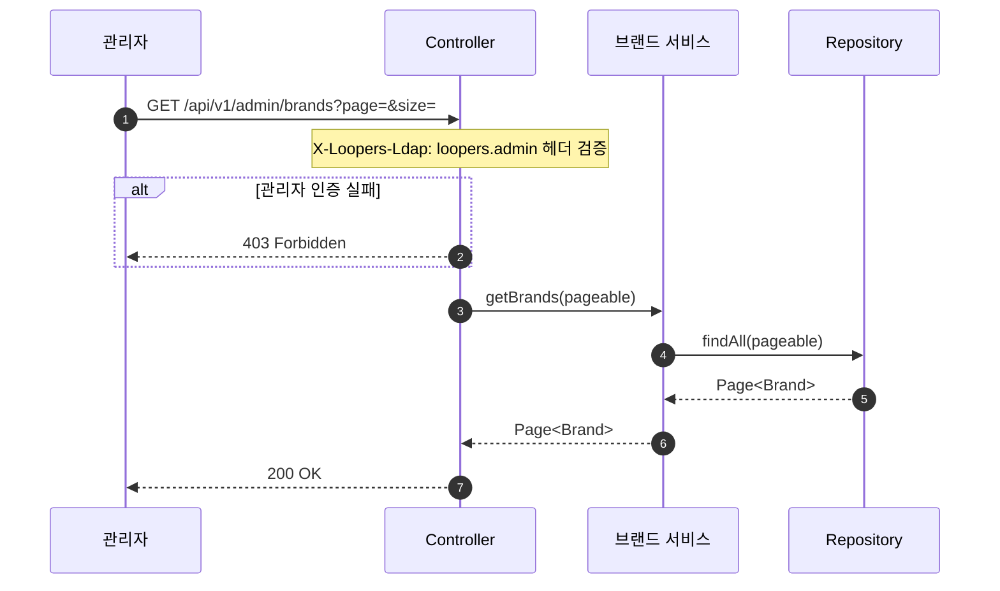
```mermaid
sequenceDiagram
    autonumber
    participant Admin as 관리자
    participant Controller
    participant Service as 브랜드 서비스
    participant Repository

    Admin->>Controller: GET /api/v1/admin/brands?page=&size=
    Note over Controller: X-Loopers-Ldap: loopers.admin 헤더 검증

    alt 관리자 인증 실패
        Controller-->>Admin: 403 Forbidden
    end

    Controller->>Service: getBrands(pageable)
    Service->>Repository: findAll(pageable)
    Repository-->>Service: Page<Brand>
    Service-->>Controller: Page<Brand>
    Controller-->>Admin: 200 OK
```

### [브랜드 상세 조회 (ADMIN)]

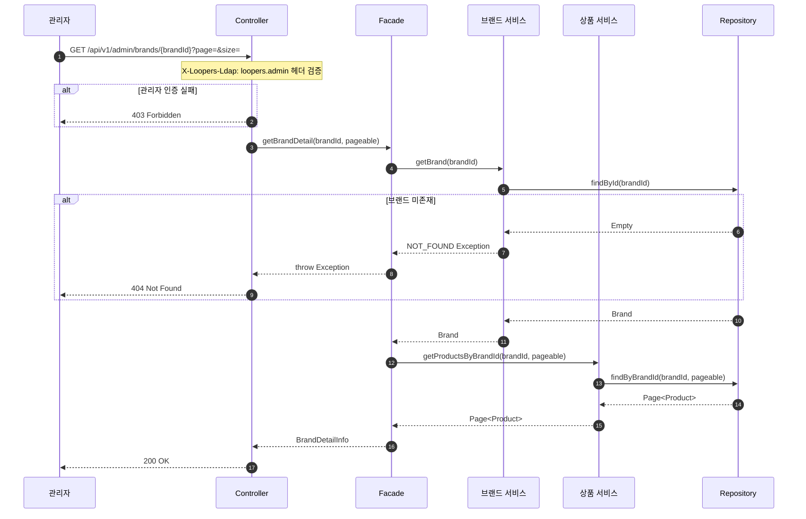
```mermaid
sequenceDiagram
    autonumber
    participant Admin as 관리자
    participant Controller
    participant Facade
    participant BrandService as 브랜드 서비스
    participant ProductService as 상품 서비스
    participant Repository

    Admin->>Controller: GET /api/v1/admin/brands/{brandId}?page=&size=
    Note over Controller: X-Loopers-Ldap: loopers.admin 헤더 검증

    alt 관리자 인증 실패
        Controller-->>Admin: 403 Forbidden
    end

    Controller->>Facade: getBrandDetail(brandId, pageable)
    Facade->>BrandService: getBrand(brandId)
    BrandService->>Repository: findById(brandId)

    alt 브랜드 미존재
        Repository-->>BrandService: Empty
        BrandService-->>Facade: NOT_FOUND Exception
        Facade-->>Controller: throw Exception
        Controller-->>Admin: 404 Not Found
    end

    Repository-->>BrandService: Brand
    BrandService-->>Facade: Brand
    Facade->>ProductService: getProductsByBrandId(brandId, pageable)
    ProductService->>Repository: findByBrandId(brandId, pageable)
    Repository-->>ProductService: Page<Product>
    ProductService-->>Facade: Page<Product>
    Facade-->>Controller: BrandDetailInfo
    Controller-->>Admin: 200 OK
```

### [브랜드 등록]

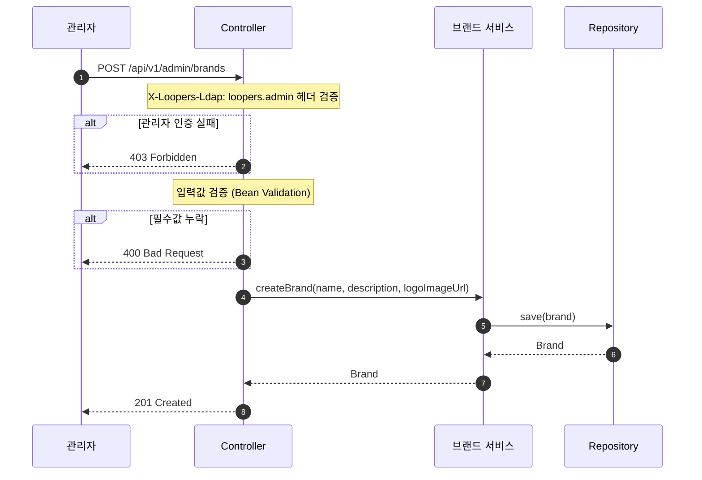
```mermaid
sequenceDiagram
    autonumber
    participant Admin as 관리자
    participant Controller
    participant BrandService as 브랜드 서비스
    participant Repository

    Admin->>Controller: POST /api/v1/admin/brands
    Note over Controller: X-Loopers-Ldap: loopers.admin 헤더 검증

    alt 관리자 인증 실패
        Controller-->>Admin: 403 Forbidden
    end

    Note over Controller: 입력값 검증 (Bean Validation)

    alt 필수값 누락
        Controller-->>Admin: 400 Bad Request
    end

    Controller->>BrandService: createBrand(name, description, logoImageUrl)

    BrandService->>Repository: save(brand)
    Repository-->>BrandService: Brand
    BrandService-->>Controller: Brand
    Controller-->>Admin: 201 Created
```

### [브랜드 정보 수정]

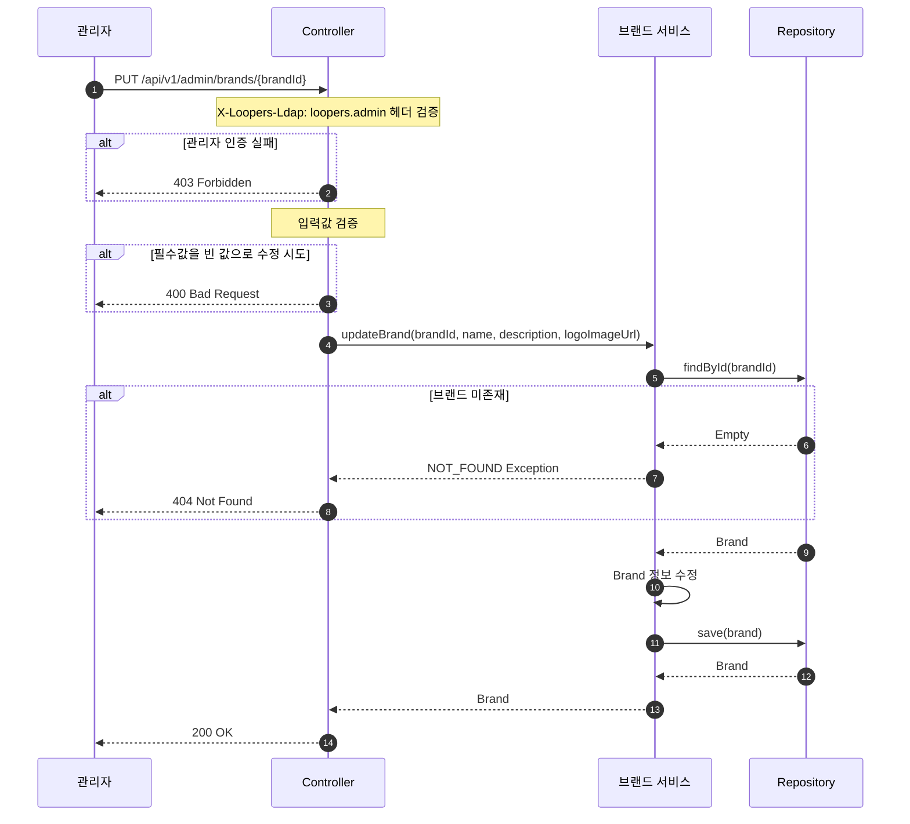
```mermaid
sequenceDiagram
    autonumber
    participant Admin as 관리자
    participant Controller
    participant BrandService as 브랜드 서비스
    participant Repository

    Admin->>Controller: PUT /api/v1/admin/brands/{brandId}
    Note over Controller: X-Loopers-Ldap: loopers.admin 헤더 검증

    alt 관리자 인증 실패
        Controller-->>Admin: 403 Forbidden
    end

    Note over Controller: 입력값 검증

    alt 필수값을 빈 값으로 수정 시도
        Controller-->>Admin: 400 Bad Request
    end

    Controller->>BrandService: updateBrand(brandId, name, description, logoImageUrl)
    BrandService->>Repository: findById(brandId)

    alt 브랜드 미존재
        Repository-->>BrandService: Empty
        BrandService-->>Controller: NOT_FOUND Exception
        Controller-->>Admin: 404 Not Found
    end

    Repository-->>BrandService: Brand
    BrandService->>BrandService: Brand 정보 수정
    BrandService->>Repository: save(brand)
    Repository-->>BrandService: Brand
    BrandService-->>Controller: Brand
    Controller-->>Admin: 200 OK
```

### [브랜드 삭제]

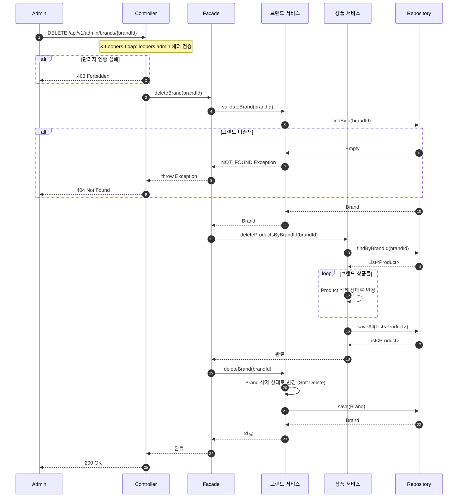
```mermaid
sequenceDiagram
    autonumber
    participant Admin
    participant Controller
    participant Facade
    participant BrandService as 브랜드 서비스
    participant ProductService as 상품 서비스
    participant Repository

    Admin->>Controller: DELETE /api/v1/admin/brands/{brandId}
    Note over Controller: X-Loopers-Ldap: loopers.admin 헤더 검증

    alt 관리자 인증 실패
        Controller-->>Admin: 403 Forbidden
    end

    Controller->>Facade: deleteBrand(brandId)
    Facade->>BrandService: validateBrand(brandId)
    BrandService->>Repository: findById(brandId)

    alt 브랜드 미존재
        Repository-->>BrandService: Empty
        BrandService-->>Facade: NOT_FOUND Exception
        Facade-->>Controller: throw Exception
        Controller-->>Admin: 404 Not Found
    end

    Repository-->>BrandService: Brand
    BrandService-->>Facade: Brand

    Facade->>ProductService: deleteProductsByBrandId(brandId)
    ProductService->>Repository: findByBrandId(brandId)
    Repository-->>ProductService: List<Product>

    loop 브랜드 상품들
        ProductService->>ProductService: Product 삭제 상태로 변경
    end

    ProductService->>Repository: saveAll(List<Product>)
    Repository-->>ProductService: List<Product>
    ProductService-->>Facade: 완료

    Facade->>BrandService: deleteBrand(brandId)
    BrandService->>BrandService: Brand 삭제 상태로 변경 (Soft Delete)
    BrandService->>Repository: save(Brand)
    Repository-->>BrandService: Brand
    BrandService-->>Facade: 완료
    Facade-->>Controller: 완료
    Controller-->>Admin: 200 OK
```

### [상품 상세 조회 (ADMIN)]

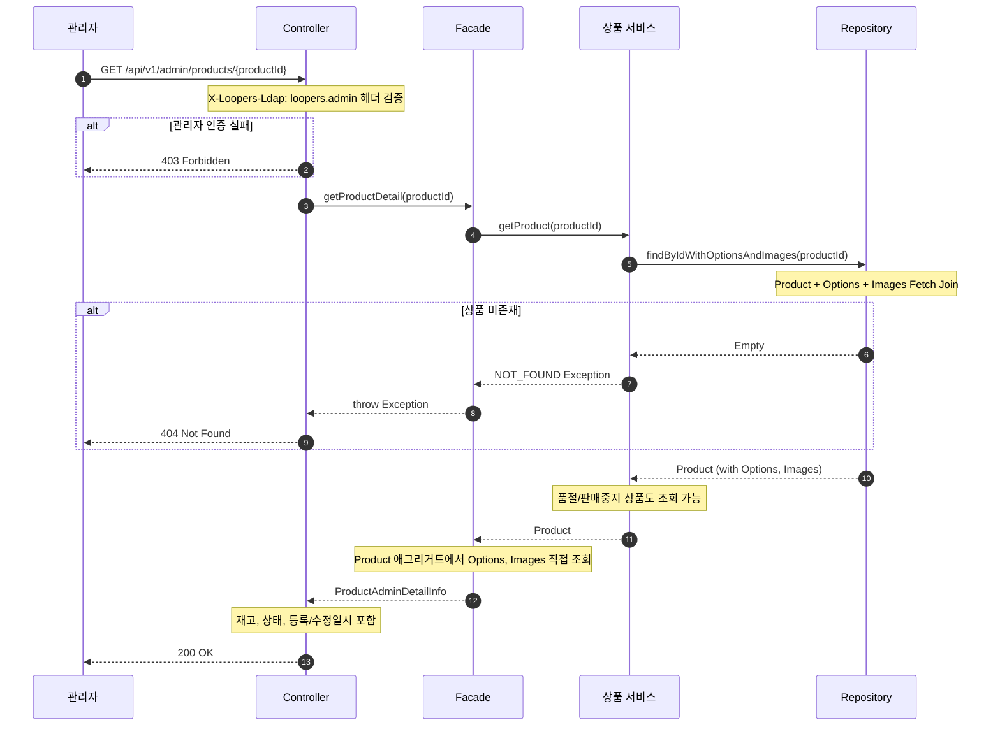
```mermaid
sequenceDiagram
    autonumber
    participant Admin as 관리자
    participant Controller
    participant Facade
    participant ProductService as 상품 서비스
    participant Repository

    Admin->>Controller: GET /api/v1/admin/products/{productId}
    Note over Controller: X-Loopers-Ldap: loopers.admin 헤더 검증

    alt 관리자 인증 실패
        Controller-->>Admin: 403 Forbidden
    end

    Controller->>Facade: getProductDetail(productId)
    Facade->>ProductService: getProduct(productId)
    ProductService->>Repository: findByIdWithOptionsAndImages(productId)
    Note over Repository: Product + Options + Images Fetch Join

    alt 상품 미존재
        Repository-->>ProductService: Empty
        ProductService-->>Facade: NOT_FOUND Exception
        Facade-->>Controller: throw Exception
        Controller-->>Admin: 404 Not Found
    end

    Repository-->>ProductService: Product (with Options, Images)
    Note over ProductService: 품절/판매중지 상품도 조회 가능
    ProductService-->>Facade: Product
    Note over Facade: Product 애그리거트에서 Options, Images 직접 조회
    Facade-->>Controller: ProductAdminDetailInfo
    Note over Controller: 재고, 상태, 등록/수정일시 포함
    Controller-->>Admin: 200 OK
```

### [상품 등록]

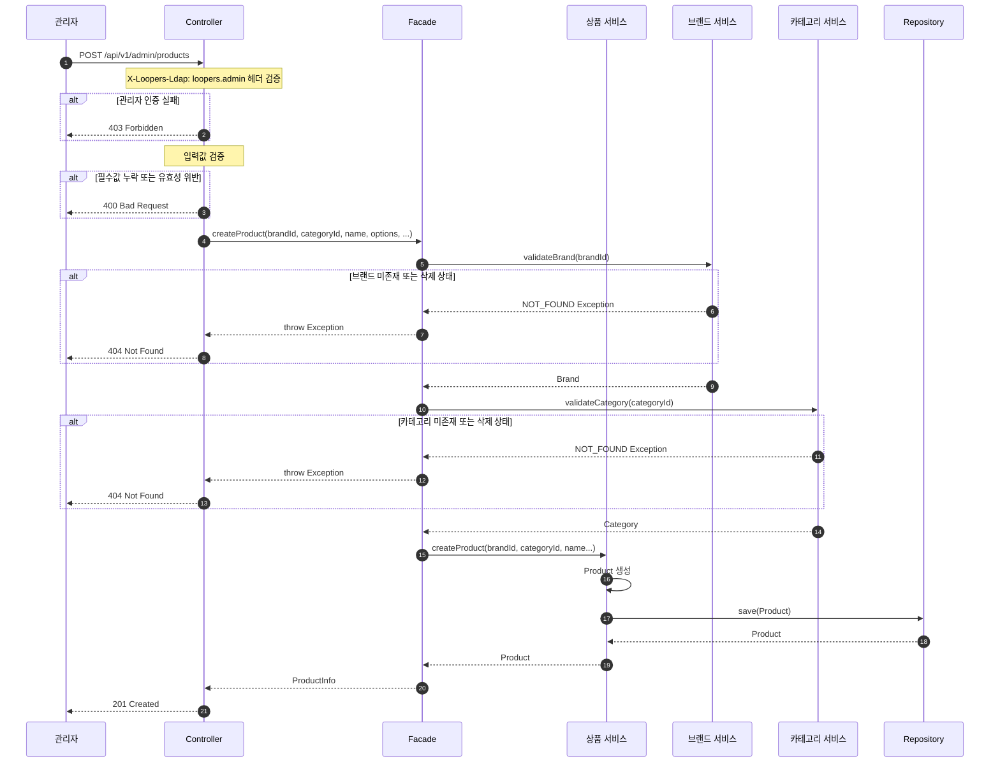
```mermaid
sequenceDiagram
    autonumber
    participant Admin as 관리자
    participant Controller
    participant Facade
    participant ProductService as 상품 서비스
    participant BrandService as 브랜드 서비스
    participant CategoryService as 카테고리 서비스
    participant Repository

    Admin->>Controller: POST /api/v1/admin/products
    Note over Controller: X-Loopers-Ldap: loopers.admin 헤더 검증

    alt 관리자 인증 실패
        Controller-->>Admin: 403 Forbidden
    end

    Note over Controller: 입력값 검증

    alt 필수값 누락 또는 유효성 위반
        Controller-->>Admin: 400 Bad Request
    end

    Controller->>Facade: createProduct(brandId, categoryId, name, options, ...)
    Facade->>BrandService: validateBrand(brandId)

    alt 브랜드 미존재 또는 삭제 상태
        BrandService-->>Facade: NOT_FOUND Exception
        Facade-->>Controller: throw Exception
        Controller-->>Admin: 404 Not Found
    end

    BrandService-->>Facade: Brand

    Facade->>CategoryService: validateCategory(categoryId)


    alt 카테고리 미존재 또는 삭제 상태
        CategoryService-->>Facade: NOT_FOUND Exception
        Facade-->>Controller: throw Exception
        Controller-->>Admin: 404 Not Found
    end

    CategoryService-->>Facade: Category

    Facade->>ProductService: createProduct(brandId, categoryId, name...)
    ProductService->>ProductService: Product 생성
    ProductService->>Repository: save(Product)
    Repository-->>ProductService: Product
    ProductService-->>Facade: Product

    Facade-->>Controller: ProductInfo
    Controller-->>Admin: 201 Created
```

### [상품 정보 수정]

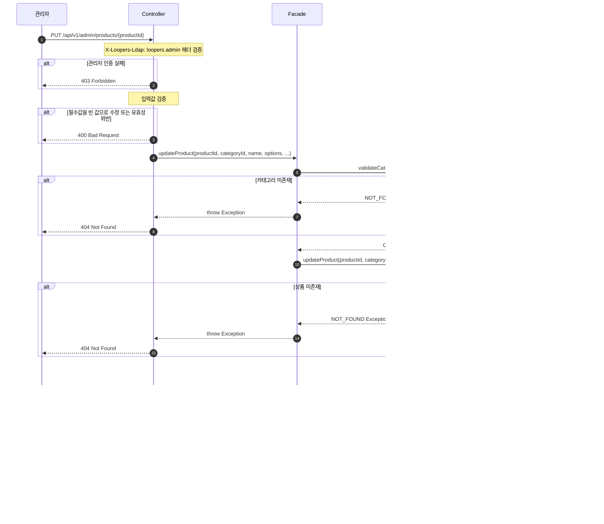
```mermaid
sequenceDiagram
    autonumber
    participant Admin as 관리자
    participant Controller
    participant Facade
    participant ProductService as 상품 서비스
    participant CategoryService as 카테고리 서비스
    participant Repository

    Admin->>Controller: PUT /api/v1/admin/products/{productId}
    Note over Controller: X-Loopers-Ldap: loopers.admin 헤더 검증

    alt 관리자 인증 실패
        Controller-->>Admin: 403 Forbidden
    end

    Note over Controller: 입력값 검증

    alt 필수값을 빈 값으로 수정 또는 유효성 위반
        Controller-->>Admin: 400 Bad Request
    end

    Controller->>Facade: updateProduct(productId, categoryId, name, options, ...)

    Facade->>CategoryService: validateCategory(categoryId)

    alt 카테고리 미존재
        CategoryService-->>Facade: NOT_FOUND Exception
        Facade-->>Controller: throw Exception
        Controller-->>Admin: 404 Not Found
    end

    CategoryService-->>Facade: Category

    Facade->>ProductService: updateProduct(productId, categoryId, name, ...)
    ProductService->>Repository: findById(productId)

    alt 상품 미존재
        Repository-->>ProductService: Empty
        ProductService-->>Facade: NOT_FOUND Exception
        Facade-->>Controller: throw Exception
        Controller-->>Admin: 404 Not Found
    end

    Repository-->>ProductService: Product
    Note over ProductService: 브랜드는 수정 불가
    ProductService->>ProductService: Product 정보 수정
    ProductService->>Repository: save(product)
    Repository-->>ProductService: Product
    ProductService-->>Facade: Product

    Facade-->>Controller: ProductInfo
    Controller-->>Admin: 200 OK
```

### [상품 삭제]

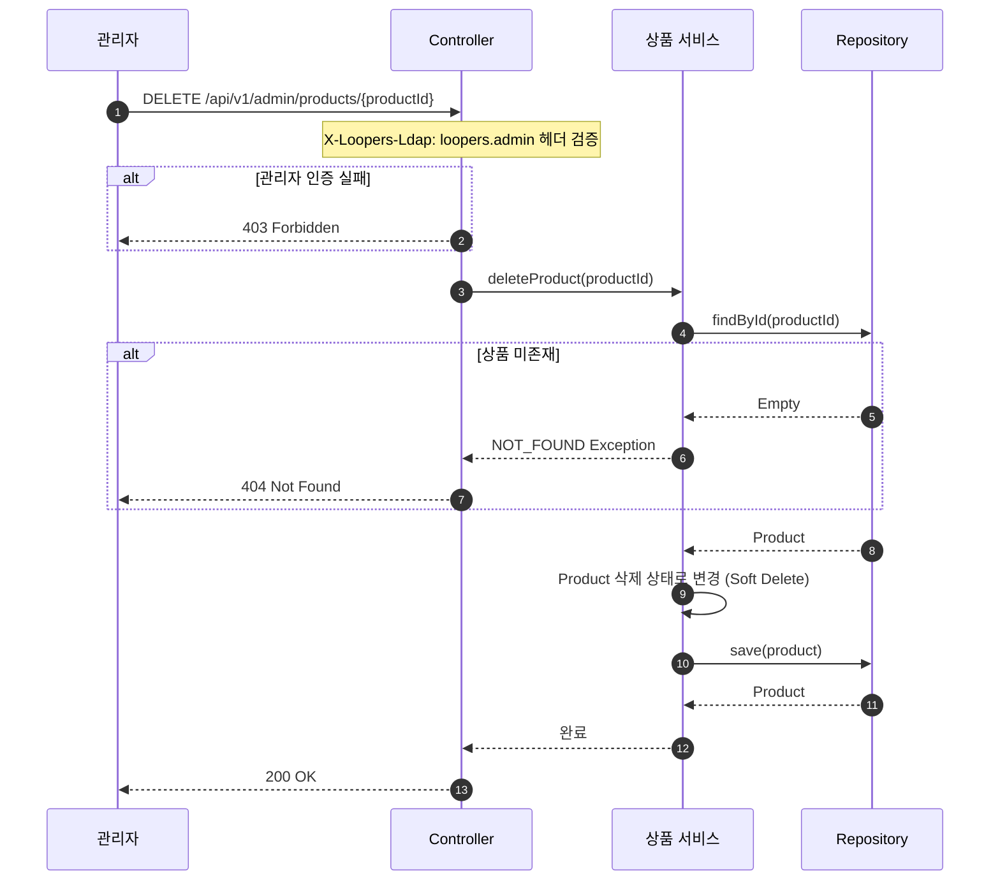
```mermaid
sequenceDiagram
    autonumber
    participant Admin as 관리자
    participant Controller
    participant ProductService as 상품 서비스
    participant Repository

    Admin->>Controller: DELETE /api/v1/admin/products/{productId}
    Note over Controller: X-Loopers-Ldap: loopers.admin 헤더 검증

    alt 관리자 인증 실패
        Controller-->>Admin: 403 Forbidden
    end

    Controller->>ProductService: deleteProduct(productId)
    ProductService->>Repository: findById(productId)

    alt 상품 미존재
        Repository-->>ProductService: Empty
        ProductService-->>Controller: NOT_FOUND Exception
        Controller-->>Admin: 404 Not Found
    end

    Repository-->>ProductService: Product
    ProductService->>ProductService: Product 삭제 상태로 변경 (Soft Delete)
    ProductService->>Repository: save(product)
    Repository-->>ProductService: Product
    ProductService-->>Controller: 완료
    Controller-->>Admin: 200 OK
```

---

## 좋아요

### [상품 좋아요 등록/취소]

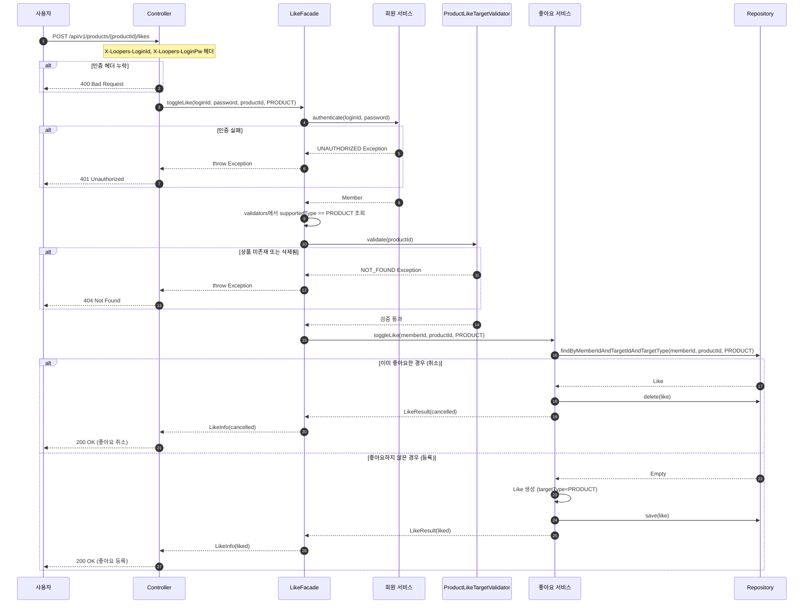
```mermaid
sequenceDiagram
    autonumber
    participant Client as 사용자
    participant Controller
    participant Facade as LikeFacade
    participant MemberService as 회원 서비스
    participant Validator as ProductLikeTargetValidator
    participant LikeService as 좋아요 서비스
    participant Repository

    Client->>Controller: POST /api/v1/products/{productId}/likes
    Note over Controller: X-Loopers-LoginId, X-Loopers-LoginPw 헤더

    alt 인증 헤더 누락
        Controller-->>Client: 400 Bad Request
    end

    Controller->>Facade: toggleLike(loginId, password, productId, PRODUCT)
    Facade->>MemberService: authenticate(loginId, password)

    alt 인증 실패
        MemberService-->>Facade: UNAUTHORIZED Exception
        Facade-->>Controller: throw Exception
        Controller-->>Client: 401 Unauthorized
    end

    MemberService-->>Facade: Member

    Facade->>Facade: validators에서 supportedType == PRODUCT 조회
    Facade->>Validator: validate(productId)

    alt 상품 미존재 또는 삭제됨
        Validator-->>Facade: NOT_FOUND Exception
        Facade-->>Controller: throw Exception
        Controller-->>Client: 404 Not Found
    end

    Validator-->>Facade: 검증 통과

    Facade->>LikeService: toggleLike(memberId, productId, PRODUCT)
    LikeService->>Repository: findByMemberIdAndTargetIdAndTargetType(memberId, productId, PRODUCT)

    alt 이미 좋아요한 경우 (취소)
        Repository-->>LikeService: Like
        LikeService->>Repository: delete(like)
        LikeService-->>Facade: LikeResult(cancelled)
        Facade-->>Controller: LikeInfo(cancelled)
        Controller-->>Client: 200 OK (좋아요 취소)
    else 좋아요하지 않은 경우 (등록)
        Repository-->>LikeService: Empty
        LikeService->>LikeService: Like 생성 (targetType=PRODUCT)
        LikeService->>Repository: save(like)
        LikeService-->>Facade: LikeResult(liked)
        Facade-->>Controller: LikeInfo(liked)
        Controller-->>Client: 200 OK (좋아요 등록)
    end
```

### [브랜드 좋아요 등록/취소]

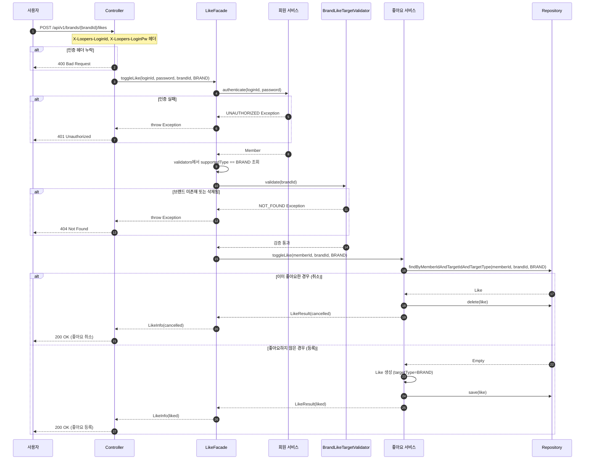
```mermaid
sequenceDiagram
    autonumber
    participant Client as 사용자
    participant Controller
    participant Facade as LikeFacade
    participant MemberService as 회원 서비스
    participant Validator as BrandLikeTargetValidator
    participant LikeService as 좋아요 서비스
    participant Repository

    Client->>Controller: POST /api/v1/brands/{brandId}/likes
    Note over Controller: X-Loopers-LoginId, X-Loopers-LoginPw 헤더

    alt 인증 헤더 누락
        Controller-->>Client: 400 Bad Request
    end

    Controller->>Facade: toggleLike(loginId, password, brandId, BRAND)
    Facade->>MemberService: authenticate(loginId, password)

    alt 인증 실패
        MemberService-->>Facade: UNAUTHORIZED Exception
        Facade-->>Controller: throw Exception
        Controller-->>Client: 401 Unauthorized
    end

    MemberService-->>Facade: Member

    Facade->>Facade: validators에서 supportedType == BRAND 조회
    Facade->>Validator: validate(brandId)

    alt 브랜드 미존재 또는 삭제됨
        Validator-->>Facade: NOT_FOUND Exception
        Facade-->>Controller: throw Exception
        Controller-->>Client: 404 Not Found
    end

    Validator-->>Facade: 검증 통과

    Facade->>LikeService: toggleLike(memberId, brandId, BRAND)
    LikeService->>Repository: findByMemberIdAndTargetIdAndTargetType(memberId, brandId, BRAND)

    alt 이미 좋아요한 경우 (취소)
        Repository-->>LikeService: Like
        LikeService->>Repository: delete(like)
        LikeService-->>Facade: LikeResult(cancelled)
        Facade-->>Controller: LikeInfo(cancelled)
        Controller-->>Client: 200 OK (좋아요 취소)
    else 좋아요하지 않은 경우 (등록)
        Repository-->>LikeService: Empty
        LikeService->>LikeService: Like 생성 (targetType=BRAND)
        LikeService->>Repository: save(like)
        LikeService-->>Facade: LikeResult(liked)
        Facade-->>Controller: LikeInfo(liked)
        Controller-->>Client: 200 OK (좋아요 등록)
    end
```

---

## 주문

### [주문 요청]

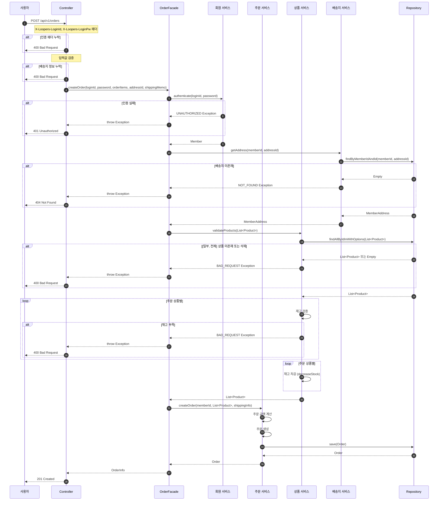
```mermaid
sequenceDiagram
    autonumber
    participant Client as 사용자
    participant Controller
    participant Facade as OrderFacade
    participant MemberService as 회원 서비스
    participant OrderService as 주문 서비스
    participant ProductService as 상품 서비스
    participant MemberAddressService as 배송지 서비스
    participant Repository

    Client->>Controller: POST /api/v1/orders
    Note over Controller: X-Loopers-LoginId, X-Loopers-LoginPw 헤더

    alt 인증 헤더 누락
        Controller-->>Client: 400 Bad Request
    end

    Note over Controller: 입력값 검증

    alt 배송지 정보 누락
        Controller-->>Client: 400 Bad Request
    end

    Controller->>Facade: createOrder(loginId, password, orderItems, addressId, shippingMemo)
    Facade->>MemberService: authenticate(loginId, password)

    alt 인증 실패
        MemberService-->>Facade: UNAUTHORIZED Exception
        Facade-->>Controller: throw Exception
        Controller-->>Client: 401 Unauthorized
    end

    MemberService-->>Facade: Member

    Facade->>MemberAddressService: getAddress(memberId, addressId)
    MemberAddressService->>Repository: findByMemberIdAndId(memberId, addressId)

    alt 배송지 미존재
        Repository-->>MemberAddressService: Empty
        MemberAddressService-->>Facade: NOT_FOUND Exception
        Facade-->>Controller: throw Exception
        Controller-->>Client: 404 Not Found
    end

    Repository-->>MemberAddressService: MemberAddress
    MemberAddressService-->>Facade: MemberAddress

    Facade->>ProductService: validateProducts(List<Product>)
    ProductService->>Repository: findAllByIdInWithOptions(List<Product>)

    alt [일부, 전체] 상품 미존재 또는 삭제
        Repository-->>ProductService: List<Product> 또는 Empty
        ProductService-->>Facade: BAD_REQUEST Exception
        Facade-->>Controller: throw Exception
        Controller-->>Client: 400 Bad Request
    end

    Repository-->>ProductService: List<Product>


    loop 주문 상품별
        ProductService->>ProductService: 재고 검증

        alt 재고 부족
            ProductService-->>Facade: BAD_REQUEST Exception
            Facade-->>Controller: throw Exception
            Controller-->>Client: 400 Bad Request
        end
    end

    loop 주문 상품별
        ProductService->>ProductService: 재고 차감 (decreaseStock)
    end

    ProductService-->>Facade: List<Product>

    Facade->>OrderService: createOrder(memberId, List<Product>, shippingInfo)


    OrderService->>OrderService: 주문 금액 계산
    OrderService->>OrderService: 주문 생성
    OrderService->>Repository: save(Order)
    Repository-->>OrderService: Order

    OrderService-->>Facade: Order
    Facade-->>Controller: OrderInfo
    Controller-->>Client: 201 Created
```

### [유저의 주문 목록 조회]

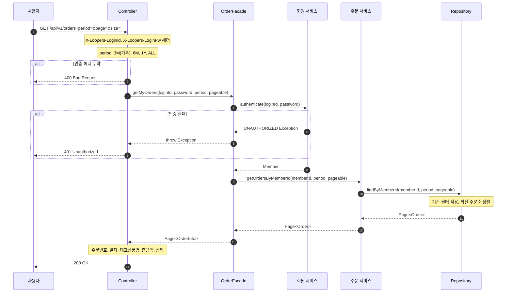
```mermaid
sequenceDiagram
    autonumber
    participant Client as 사용자
    participant Controller
    participant Facade as OrderFacade
    participant MemberService as 회원 서비스
    participant OrderService as 주문 서비스
    participant Repository

    Client->>Controller: GET /api/v1/orders?period=&page=&size=
    Note over Controller: X-Loopers-LoginId, X-Loopers-LoginPw 헤더
    Note over Controller: period: 3M(기본), 6M, 1Y, ALL

    alt 인증 헤더 누락
        Controller-->>Client: 400 Bad Request
    end

    Controller->>Facade: getMyOrders(loginId, password, period, pageable)
    Facade->>MemberService: authenticate(loginId, password)

    alt 인증 실패
        MemberService-->>Facade: UNAUTHORIZED Exception
        Facade-->>Controller: throw Exception
        Controller-->>Client: 401 Unauthorized
    end

    MemberService-->>Facade: Member

    Facade->>OrderService: getOrdersByMemberId(memberId, period, pageable)
    OrderService->>Repository: findByMemberId(memberId, period, pageable)
    Note over Repository: 기간 필터 적용, 최신 주문순 정렬
    Repository-->>OrderService: Page<Order>
    OrderService-->>Facade: Page<Order>
    Facade-->>Controller: Page<OrderInfo>
    Note over Controller: 주문번호, 일자, 대표상품명, 총금액, 상태
    Controller-->>Client: 200 OK
```

### [단일 주문 상세 조회]

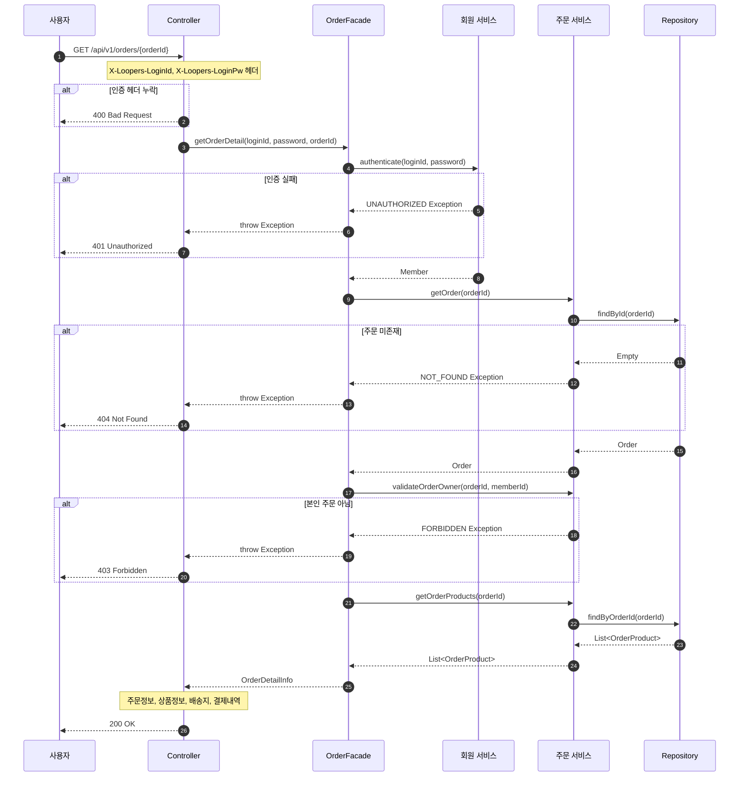
```mermaid
sequenceDiagram
    autonumber
    participant Client as 사용자
    participant Controller
    participant Facade as OrderFacade
    participant MemberService as 회원 서비스
    participant OrderService as 주문 서비스
    participant Repository

    Client->>Controller: GET /api/v1/orders/{orderId}
    Note over Controller: X-Loopers-LoginId, X-Loopers-LoginPw 헤더

    alt 인증 헤더 누락
        Controller-->>Client: 400 Bad Request
    end

    Controller->>Facade: getOrderDetail(loginId, password, orderId)
    Facade->>MemberService: authenticate(loginId, password)

    alt 인증 실패
        MemberService-->>Facade: UNAUTHORIZED Exception
        Facade-->>Controller: throw Exception
        Controller-->>Client: 401 Unauthorized
    end

    MemberService-->>Facade: Member

    Facade->>OrderService: getOrder(orderId)
    OrderService->>Repository: findById(orderId)

    alt 주문 미존재
        Repository-->>OrderService: Empty
        OrderService-->>Facade: NOT_FOUND Exception
        Facade-->>Controller: throw Exception
        Controller-->>Client: 404 Not Found
    end

    Repository-->>OrderService: Order
    OrderService-->>Facade: Order

    Facade->>OrderService: validateOrderOwner(orderId, memberId)

    alt 본인 주문 아님
        OrderService-->>Facade: FORBIDDEN Exception
        Facade-->>Controller: throw Exception
        Controller-->>Client: 403 Forbidden
    end

    Facade->>OrderService: getOrderProducts(orderId)
    OrderService->>Repository: findByOrderId(orderId)
    Repository-->>OrderService: List<OrderProduct>
    OrderService-->>Facade: List<OrderProduct>
    Facade-->>Controller: OrderDetailInfo
    Note over Controller: 주문정보, 상품정보, 배송지, 결제내역
    Controller-->>Client: 200 OK
```

### [주문 취소]

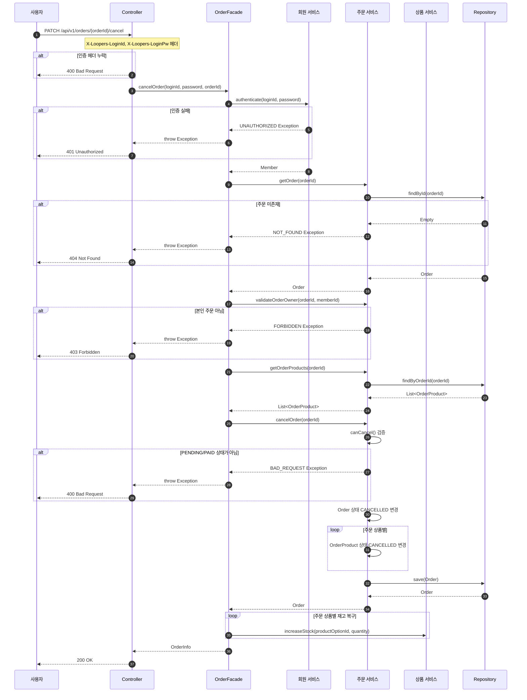
```mermaid
sequenceDiagram
    autonumber
    participant Client as 사용자
    participant Controller
    participant Facade as OrderFacade
    participant MemberService as 회원 서비스
    participant OrderService as 주문 서비스
    participant ProductService as 상품 서비스
    participant Repository

    Client->>Controller: PATCH /api/v1/orders/{orderId}/cancel
    Note over Controller: X-Loopers-LoginId, X-Loopers-LoginPw 헤더

    alt 인증 헤더 누락
        Controller-->>Client: 400 Bad Request
    end

    Controller->>Facade: cancelOrder(loginId, password, orderId)
    Facade->>MemberService: authenticate(loginId, password)

    alt 인증 실패
        MemberService-->>Facade: UNAUTHORIZED Exception
        Facade-->>Controller: throw Exception
        Controller-->>Client: 401 Unauthorized
    end

    MemberService-->>Facade: Member

    Facade->>OrderService: getOrder(orderId)
    OrderService->>Repository: findById(orderId)

    alt 주문 미존재
        Repository-->>OrderService: Empty
        OrderService-->>Facade: NOT_FOUND Exception
        Facade-->>Controller: throw Exception
        Controller-->>Client: 404 Not Found
    end

    Repository-->>OrderService: Order
    OrderService-->>Facade: Order

    Facade->>OrderService: validateOrderOwner(orderId, memberId)

    alt 본인 주문 아님
        OrderService-->>Facade: FORBIDDEN Exception
        Facade-->>Controller: throw Exception
        Controller-->>Client: 403 Forbidden
    end

    Facade->>OrderService: getOrderProducts(orderId)
    OrderService->>Repository: findByOrderId(orderId)
    Repository-->>OrderService: List<OrderProduct>
    OrderService-->>Facade: List<OrderProduct>

    Facade->>OrderService: cancelOrder(orderId)
    OrderService->>OrderService: canCancel() 검증

    alt PENDING/PAID 상태가 아님
        OrderService-->>Facade: BAD_REQUEST Exception
        Facade-->>Controller: throw Exception
        Controller-->>Client: 400 Bad Request
    end

    OrderService->>OrderService: Order 상태 CANCELLED 변경

    loop 주문 상품별
        OrderService->>OrderService: OrderProduct 상태 CANCELLED 변경
    end

    OrderService->>Repository: save(Order)
    Repository-->>OrderService: Order
    OrderService-->>Facade: Order

    loop 주문 상품별 재고 복구
        Facade->>ProductService: increaseStock(productOptionId, quantity)
    end

    Facade-->>Controller: OrderInfo
    Controller-->>Client: 200 OK
```

---

## 쿠폰 관리 (Admin)

### [쿠폰 템플릿 목록 조회]

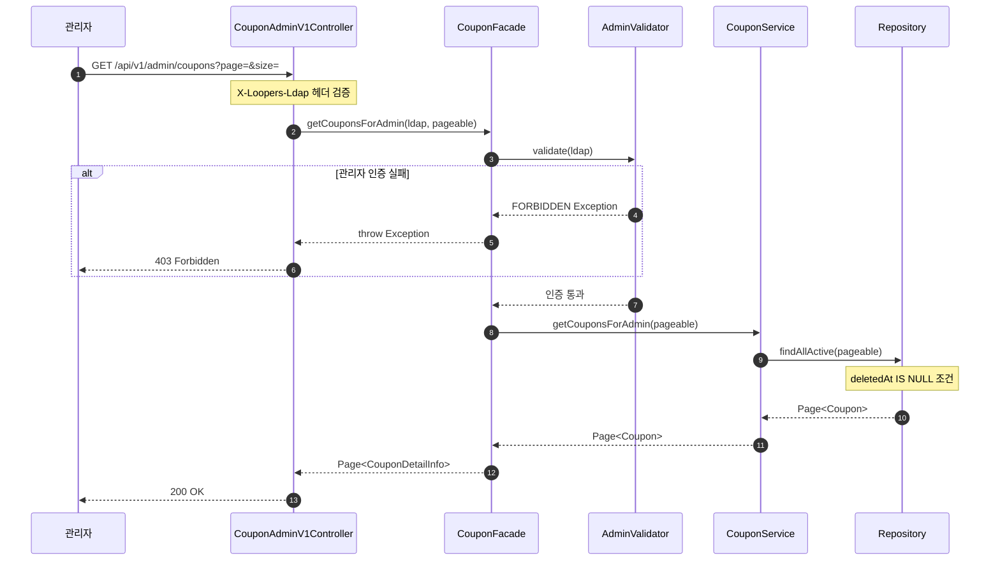
```mermaid
sequenceDiagram
    autonumber
    participant Admin as 관리자
    participant Controller as CouponAdminV1Controller
    participant Facade as CouponFacade
    participant AdminValidator
    participant Service as CouponService
    participant Repository

    Admin->>Controller: GET /api/v1/admin/coupons?page=&size=
    Note over Controller: X-Loopers-Ldap 헤더 검증

    Controller->>Facade: getCouponsForAdmin(ldap, pageable)
    Facade->>AdminValidator: validate(ldap)

    alt 관리자 인증 실패
        AdminValidator-->>Facade: FORBIDDEN Exception
        Facade-->>Controller: throw Exception
        Controller-->>Admin: 403 Forbidden
    end

    AdminValidator-->>Facade: 인증 통과
    Facade->>Service: getCouponsForAdmin(pageable)
    Service->>Repository: findAllActive(pageable)
    Note over Repository: deletedAt IS NULL 조건
    Repository-->>Service: Page<Coupon>
    Service-->>Facade: Page<Coupon>
    Facade-->>Controller: Page<CouponDetailInfo>
    Controller-->>Admin: 200 OK
```

### [쿠폰 템플릿 등록]

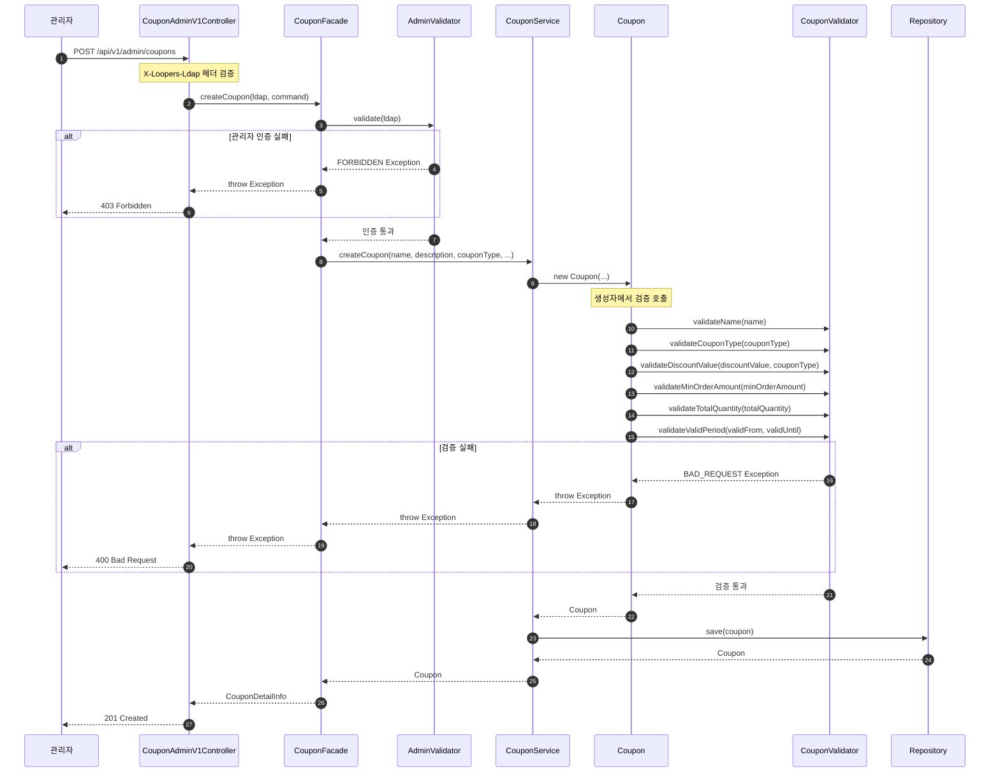
```mermaid
sequenceDiagram
    autonumber
    participant Admin as 관리자
    participant Controller as CouponAdminV1Controller
    participant Facade as CouponFacade
    participant AdminValidator
    participant Service as CouponService
    participant Coupon
    participant CouponValidator
    participant Repository

    Admin->>Controller: POST /api/v1/admin/coupons
    Note over Controller: X-Loopers-Ldap 헤더 검증

    Controller->>Facade: createCoupon(ldap, command)
    Facade->>AdminValidator: validate(ldap)

    alt 관리자 인증 실패
        AdminValidator-->>Facade: FORBIDDEN Exception
        Facade-->>Controller: throw Exception
        Controller-->>Admin: 403 Forbidden
    end

    AdminValidator-->>Facade: 인증 통과

    Facade->>Service: createCoupon(name, description, couponType, ...)
    Service->>Coupon: new Coupon(...)

    Note over Coupon: 생성자에서 검증 호출
    Coupon->>CouponValidator: validateName(name)
    Coupon->>CouponValidator: validateCouponType(couponType)
    Coupon->>CouponValidator: validateDiscountValue(discountValue, couponType)
    Coupon->>CouponValidator: validateMinOrderAmount(minOrderAmount)
    Coupon->>CouponValidator: validateTotalQuantity(totalQuantity)
    Coupon->>CouponValidator: validateValidPeriod(validFrom, validUntil)

    alt 검증 실패
        CouponValidator-->>Coupon: BAD_REQUEST Exception
        Coupon-->>Service: throw Exception
        Service-->>Facade: throw Exception
        Facade-->>Controller: throw Exception
        Controller-->>Admin: 400 Bad Request
    end

    CouponValidator-->>Coupon: 검증 통과
    Coupon-->>Service: Coupon

    Service->>Repository: save(coupon)
    Repository-->>Service: Coupon
    Service-->>Facade: Coupon
    Facade-->>Controller: CouponDetailInfo
    Controller-->>Admin: 201 Created
```

### [쿠폰 템플릿 수정]

```mermaid
sequenceDiagram
    autonumber
    participant Admin as 관리자
    participant Controller as CouponAdminV1Controller
    participant Facade as CouponFacade
    participant AdminValidator
    participant Service as CouponService
    participant Coupon
    participant Repository

    Admin->>Controller: PUT /api/v1/admin/coupons/{couponId}
    Note over Controller: X-Loopers-Ldap 헤더 검증

    Controller->>Facade: updateCoupon(ldap, couponId, command)
    Facade->>AdminValidator: validate(ldap)

    alt 관리자 인증 실패
        AdminValidator-->>Facade: FORBIDDEN Exception
        Facade-->>Controller: throw Exception
        Controller-->>Admin: 403 Forbidden
    end

    AdminValidator-->>Facade: 인증 통과

    Facade->>Service: updateCoupon(couponId, name, ...)
    Service->>Repository: findById(couponId)

    alt 쿠폰 미존재
        Repository-->>Service: Empty
        Service-->>Facade: NOT_FOUND Exception
        Facade-->>Controller: throw Exception
        Controller-->>Admin: 404 Not Found
    end

    Repository-->>Service: Coupon
    Service->>Coupon: isDeleted()

    alt 삭제된 쿠폰
        Coupon-->>Service: true
        Service-->>Facade: NOT_FOUND Exception
        Facade-->>Controller: throw Exception
        Controller-->>Admin: 404 Not Found
    end

    Service->>Coupon: update(name, description, ...)
    Note over Coupon: update() 내부에서 검증 수행

    alt totalQuantity < issuedQuantity
        Coupon-->>Service: BAD_REQUEST Exception
        Service-->>Facade: throw Exception
        Facade-->>Controller: throw Exception
        Controller-->>Admin: 400 Bad Request
    end

    Coupon-->>Service: 업데이트 완료
    Service->>Repository: save(coupon)
    Repository-->>Service: Coupon
    Service-->>Facade: Coupon
    Facade-->>Controller: CouponDetailInfo
    Controller-->>Admin: 200 OK
```

### [쿠폰 템플릿 삭제]

```mermaid
sequenceDiagram
    autonumber
    participant Admin as 관리자
    participant Controller as CouponAdminV1Controller
    participant Facade as CouponFacade
    participant AdminValidator
    participant Service as CouponService
    participant Coupon
    participant Repository

    Admin->>Controller: DELETE /api/v1/admin/coupons/{couponId}
    Note over Controller: X-Loopers-Ldap 헤더 검증

    Controller->>Facade: deleteCoupon(ldap, couponId)
    Facade->>AdminValidator: validate(ldap)

    alt 관리자 인증 실패
        AdminValidator-->>Facade: FORBIDDEN Exception
        Facade-->>Controller: throw Exception
        Controller-->>Admin: 403 Forbidden
    end

    AdminValidator-->>Facade: 인증 통과

    Facade->>Service: deleteCoupon(couponId)
    Service->>Repository: findById(couponId)

    alt 쿠폰 미존재
        Repository-->>Service: Empty
        Service-->>Facade: NOT_FOUND Exception
        Facade-->>Controller: throw Exception
        Controller-->>Admin: 404 Not Found
    end

    Repository-->>Service: Coupon
    Service->>Coupon: isDeleted()

    alt 이미 삭제된 쿠폰
        Coupon-->>Service: true
        Service-->>Facade: NOT_FOUND Exception
        Facade-->>Controller: throw Exception
        Controller-->>Admin: 404 Not Found
    end

    Service->>Coupon: delete()
    Note over Coupon: deletedAt = now()
    Service->>Repository: save(coupon)
    Repository-->>Service: Coupon
    Service-->>Facade: 완료
    Facade-->>Controller: 완료
    Controller-->>Admin: 200 OK
```

---

## 쿠폰 발급 (User)

### [발급 가능 쿠폰 목록 조회]

```mermaid
sequenceDiagram
    autonumber
    participant User as 사용자
    participant Controller as CouponV1Controller
    participant Facade as CouponFacade
    participant MemberService
    participant CouponService
    participant MemberCouponService
    participant Repository

    User->>Controller: GET /api/v1/coupons
    Note over Controller: X-Loopers-LoginId, X-Loopers-LoginPw 헤더

    alt 인증 헤더 누락
        Controller-->>User: 400 Bad Request
    end

    Controller->>Facade: getIssuableCoupons(loginId, loginPw)
    Facade->>MemberService: authenticate(loginId, loginPw)

    alt 인증 실패
        MemberService-->>Facade: UNAUTHORIZED Exception
        Facade-->>Controller: throw Exception
        Controller-->>User: 401 Unauthorized
    end

    MemberService-->>Facade: Member

    Facade->>CouponService: getIssuableCoupons()
    CouponService->>Repository: findAllIssuable()
    Note over Repository: deletedAt IS NULL AND<br/>validFrom <= now() <= validUntil AND<br/>issuedQuantity < totalQuantity
    Repository-->>CouponService: List<Coupon>
    CouponService-->>Facade: List<Coupon>

    Facade->>MemberCouponService: getIssuedCouponIds(memberId)
    MemberCouponService->>Repository: findIssuedCouponIdsByMemberId(memberId)
    Repository-->>MemberCouponService: List<Long>
    MemberCouponService-->>Facade: Set<Long> issuedCouponIds

    Note over Facade: 각 쿠폰에 alreadyIssued 표시

    Facade-->>Controller: List<CouponInfo>
    Controller-->>User: 200 OK
```

### [쿠폰 발급]

```mermaid
sequenceDiagram
    autonumber
    participant User as 사용자
    participant Controller as CouponV1Controller
    participant Facade as CouponFacade
    participant MemberService
    participant MemberCouponService
    participant CouponRepository
    participant CodeGenerator as CouponCodeGenerator
    participant MemberCouponRepository
    participant Coupon

    User->>Controller: POST /api/v1/coupons/{couponId}/issue
    Note over Controller: X-Loopers-LoginId, X-Loopers-LoginPw 헤더

    Controller->>Facade: issueCoupon(loginId, loginPw, couponId)
    Facade->>MemberService: authenticate(loginId, loginPw)

    alt 인증 실패
        MemberService-->>Facade: UNAUTHORIZED Exception
        Facade-->>Controller: throw Exception
        Controller-->>User: 401 Unauthorized
    end

    MemberService-->>Facade: Member

    Facade->>MemberCouponService: issueCoupon(memberId, couponId)
    MemberCouponService->>MemberCouponRepository: existsByMemberIdAndCouponId(memberId, couponId)

    alt 이미 발급받은 쿠폰
        MemberCouponRepository-->>MemberCouponService: true
        MemberCouponService-->>Facade: CONFLICT Exception
        Facade-->>Controller: throw Exception
        Controller-->>User: 409 Conflict
    end

    MemberCouponRepository-->>MemberCouponService: false

    MemberCouponService->>CouponRepository: findById(couponId)

    alt 쿠폰 미존재
        CouponRepository-->>MemberCouponService: Empty
        MemberCouponService-->>Facade: NOT_FOUND Exception
        Facade-->>Controller: throw Exception
        Controller-->>User: 404 Not Found
    end

    CouponRepository-->>MemberCouponService: Coupon

    MemberCouponService->>Coupon: issue()
    Note over Coupon: canIssue() 검증 후<br/>issuedQuantity++

    alt 삭제된 쿠폰
        Coupon-->>MemberCouponService: NOT_FOUND Exception
        MemberCouponService-->>Facade: throw Exception
        Facade-->>Controller: throw Exception
        Controller-->>User: 404 Not Found
    end

    alt 발급 기간이 아님
        Coupon-->>MemberCouponService: BAD_REQUEST Exception
        MemberCouponService-->>Facade: throw Exception
        Facade-->>Controller: throw Exception
        Controller-->>User: 400 Bad Request
    end

    alt 발급 수량 소진
        Coupon-->>MemberCouponService: BAD_REQUEST Exception
        MemberCouponService-->>Facade: throw Exception
        Facade-->>Controller: throw Exception
        Controller-->>User: 400 Bad Request
    end

    MemberCouponService->>CouponRepository: save(coupon)
    CouponRepository-->>MemberCouponService: Coupon

    MemberCouponService->>CodeGenerator: generate()
    Note over CodeGenerator: 12자리 랜덤 코드<br/>(XXXX-XXXX-XXXX)
    CodeGenerator-->>MemberCouponService: "A1B2-C3D4-E5F6"

    MemberCouponService->>MemberCouponService: new MemberCoupon(memberId, couponId, code, expiredAt)
    MemberCouponService->>MemberCouponRepository: save(memberCoupon)
    MemberCouponRepository-->>MemberCouponService: MemberCoupon

    MemberCouponService-->>Facade: MemberCoupon
    Facade-->>Controller: MemberCouponInfo
    Controller-->>User: 201 Created
```

### [내 쿠폰 목록 조회]

```mermaid
sequenceDiagram
    autonumber
    participant User as 사용자
    participant Controller as CouponV1Controller
    participant Facade as CouponFacade
    participant MemberService
    participant MemberCouponService
    participant Repository

    User->>Controller: GET /api/v1/coupons/my?status=AVAILABLE
    Note over Controller: X-Loopers-LoginId, X-Loopers-LoginPw 헤더
    Note over Controller: status: AVAILABLE, USED, EXPIRED (optional)

    Controller->>Facade: getMyCoupons(loginId, loginPw, status)
    Facade->>MemberService: authenticate(loginId, loginPw)

    alt 인증 실패
        MemberService-->>Facade: UNAUTHORIZED Exception
        Facade-->>Controller: throw Exception
        Controller-->>User: 401 Unauthorized
    end

    MemberService-->>Facade: Member

    alt status 파라미터 존재
        Facade->>MemberCouponService: getMemberCouponsByStatus(memberId, status)
        MemberCouponService->>Repository: findAllByMemberIdAndStatus(memberId, status)
    else status 파라미터 없음
        Facade->>MemberCouponService: getMemberCoupons(memberId)
        MemberCouponService->>Repository: findAllByMemberId(memberId)
    end

    Note over Repository: 쿠폰 정보 함께 조회 (Fetch Join)
    Repository-->>MemberCouponService: List<MemberCoupon>
    MemberCouponService-->>Facade: List<MemberCoupon>

    Note over Facade: 상태별 카운트 계산<br/>(totalCount, availableCount, usedCount, expiredCount)

    Facade-->>Controller: MemberCouponListInfo
    Controller-->>User: 200 OK
```

---

## 주문 시 쿠폰 적용

### [주문 생성 시 쿠폰 적용]

```mermaid
sequenceDiagram
    autonumber
    participant User as 사용자
    participant OrderFacade
    participant CouponFacade
    participant MemberCouponService
    participant MemberCoupon
    participant Coupon
    participant OrderService
    participant Repository

    User->>OrderFacade: createOrder(command with memberCouponId)
    Note over OrderFacade: 회원 인증, 배송지 조회,<br/>상품 검증, 재고 차감 완료 후

    alt memberCouponId != null
        OrderFacade->>CouponFacade: calculateCouponDiscount(memberCouponId, memberId, orderAmount)
        CouponFacade->>MemberCouponService: getMemberCouponWithCoupon(memberCouponId)
        MemberCouponService->>Repository: findByIdWithCoupon(memberCouponId)

        alt 쿠폰 미존재
            Repository-->>MemberCouponService: Empty
            MemberCouponService-->>CouponFacade: NOT_FOUND Exception
            CouponFacade-->>OrderFacade: throw Exception
            OrderFacade-->>User: 404 Not Found
        end

        Repository-->>MemberCouponService: MemberCoupon (with Coupon)
        MemberCouponService-->>CouponFacade: MemberCoupon

        CouponFacade->>MemberCoupon: isOwnedBy(memberId)

        alt 본인 쿠폰 아님
            MemberCoupon-->>CouponFacade: FORBIDDEN Exception
            CouponFacade-->>OrderFacade: throw Exception
            OrderFacade-->>User: 403 Forbidden
        end

        CouponFacade->>MemberCoupon: isAvailable()

        alt 사용 불가능한 쿠폰 (USED, EXPIRED)
            MemberCoupon-->>CouponFacade: BAD_REQUEST Exception
            CouponFacade-->>OrderFacade: throw Exception
            OrderFacade-->>User: 400 Bad Request
        end

        CouponFacade->>Coupon: calculateDiscount(orderAmount)

        alt 최소 주문 금액 미달
            Coupon-->>CouponFacade: BAD_REQUEST Exception
            CouponFacade-->>OrderFacade: throw Exception
            OrderFacade-->>User: 400 Bad Request
        end

        Note over Coupon: FIXED_AMOUNT: discountValue<br/>PERCENTAGE: orderAmount × discountValue / 100<br/>(maxDiscountAmount 적용)
        Coupon-->>CouponFacade: discountAmount
        CouponFacade-->>OrderFacade: discountAmount

        OrderFacade->>OrderService: createOrder(discountAmount 적용)
        OrderService->>Repository: save(Order)
        Repository-->>OrderService: Order

        OrderFacade->>CouponFacade: applyCoupon(memberCouponId, orderId)
        CouponFacade->>MemberCouponService: useCoupon(memberCouponId, orderId)
        MemberCouponService->>MemberCoupon: use(orderId)
        Note over MemberCoupon: status = USED<br/>usedOrderId = orderId<br/>usedAt = now()
        MemberCouponService->>Repository: save(memberCoupon)
        Repository-->>MemberCouponService: MemberCoupon
        MemberCouponService-->>CouponFacade: 완료
        CouponFacade-->>OrderFacade: 완료
    end

    OrderFacade-->>User: OrderDetailInfo
```

### [주문 취소 시 쿠폰 복구]

```mermaid
sequenceDiagram
    autonumber
    participant User as 사용자
    participant OrderFacade
    participant OrderService
    participant CouponFacade
    participant MemberCouponService
    participant MemberCoupon
    participant Repository

    User->>OrderFacade: cancelOrder(orderId)
    Note over OrderFacade: 회원 인증, 주문 조회,<br/>소유권 검증 완료 후

    OrderFacade->>OrderService: cancelOrder(orderId)
    Note over OrderService: canCancel() 검증<br/>Order 상태 CANCELLED 변경<br/>OrderProducts 상태 CANCELLED 변경
    OrderService->>Repository: save(Order)
    Repository-->>OrderService: Order
    OrderService-->>OrderFacade: Order

    Note over OrderFacade: 재고 복구 처리

    OrderFacade->>CouponFacade: cancelCouponUsage(orderId)
    CouponFacade->>MemberCouponService: cancelCouponUsage(orderId)
    MemberCouponService->>Repository: findByUsedOrderId(orderId)

    alt 해당 주문에 적용된 쿠폰 없음
        Repository-->>MemberCouponService: Empty
        MemberCouponService-->>CouponFacade: 완료 (아무 작업 없음)
        CouponFacade-->>OrderFacade: 완료
    else 쿠폰 적용되어 있음
        Repository-->>MemberCouponService: MemberCoupon
        MemberCouponService->>MemberCoupon: cancelUse()
        Note over MemberCoupon: status = AVAILABLE<br/>usedOrderId = null<br/>usedAt = null
        MemberCouponService->>Repository: save(memberCoupon)
        Repository-->>MemberCouponService: MemberCoupon
        MemberCouponService-->>CouponFacade: 완료
        CouponFacade-->>OrderFacade: 완료
    end

    OrderFacade-->>User: OrderDetailInfo
```

---

## 할인 계산 상세

### [쿠폰 할인액 계산 로직]

```mermaid
sequenceDiagram
    autonumber
    participant Caller
    participant Coupon
    participant Result

    Caller->>Coupon: calculateDiscount(orderAmount)

    Coupon->>Coupon: orderAmount < minOrderAmount?

    alt 최소 주문 금액 미달
        Coupon-->>Caller: BAD_REQUEST Exception<br/>"최소 주문 금액 X원 이상이어야 합니다"
    end

    alt couponType == FIXED_AMOUNT
        Coupon->>Coupon: discount = discountValue
    else couponType == PERCENTAGE
        Coupon->>Coupon: discount = orderAmount × discountValue / 100
        Coupon->>Coupon: maxDiscountAmount != null?
        alt 최대 할인 금액 제한 있음
            Coupon->>Coupon: discount = min(discount, maxDiscountAmount)
        end
    end

    Coupon->>Coupon: discount = min(discount, orderAmount)
    Note over Coupon: 할인액이 주문금액을 초과하지 않도록

    Coupon-->>Caller: discount
```