# 시퀀스 다이어그램

## 브랜드 & 상품

### [브랜드 정보 조회]

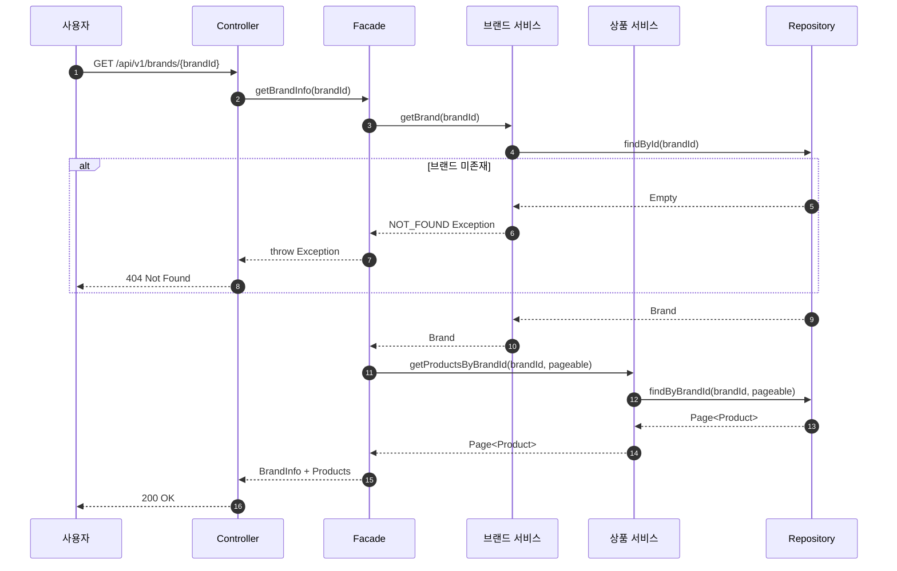
```mermaid
sequenceDiagram
    autonumber
    participant Client as 사용자
    participant Controller
    participant Facade
    participant BrandService as 브랜드 서비스
    participant ProductService as 상품 서비스
    participant Repository

    Client->>Controller: GET /api/v1/brands/{brandId}
    Controller->>Facade: getBrandInfo(brandId)
    Facade->>BrandService: getBrand(brandId)
    BrandService->>Repository: findById(brandId)

    alt 브랜드 미존재
        Repository-->>BrandService: Empty
        BrandService-->>Facade: NOT_FOUND Exception
        Facade-->>Controller: throw Exception
        Controller-->>Client: 404 Not Found
    end

    Repository-->>BrandService: Brand
    BrandService-->>Facade: Brand
    Facade->>ProductService: getProductsByBrandId(brandId, pageable)
    ProductService->>Repository: findByBrandId(brandId, pageable)
    Repository-->>ProductService: Page<Product>
    ProductService-->>Facade: Page<Product>
    Facade-->>Controller: BrandInfo + Products
    Controller-->>Client: 200 OK
```

### [상품 목록 조회]

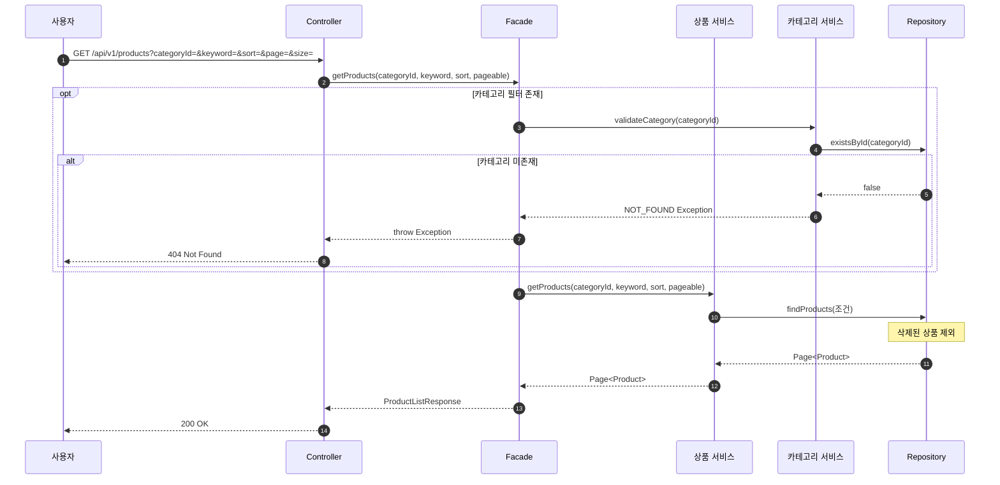
```mermaid
sequenceDiagram
    autonumber
    participant Client as 사용자
    participant Controller
    participant Facade
    participant ProductService as 상품 서비스
    participant CategoryService as 카테고리 서비스
    participant Repository

    Client->>Controller: GET /api/v1/products?categoryId=&keyword=&sort=&page=&size=
    Controller->>Facade: getProducts(categoryId, keyword, sort, pageable)

    opt 카테고리 필터 존재
        Facade->>CategoryService: validateCategory(categoryId)
        CategoryService->>Repository: existsById(categoryId)

        alt 카테고리 미존재
            Repository-->>CategoryService: false
            CategoryService-->>Facade: NOT_FOUND Exception
            Facade-->>Controller: throw Exception
            Controller-->>Client: 404 Not Found
        end
    end

    Facade->>ProductService: getProducts(categoryId, keyword, sort, pageable)
    ProductService->>Repository: findProducts(조건)
    Note over Repository: 삭제된 상품 제외
    Repository-->>ProductService: Page<Product>
    ProductService-->>Facade: Page<Product>
    Facade-->>Controller: ProductListResponse
    Controller-->>Client: 200 OK
```

### [상품 정보 조회]

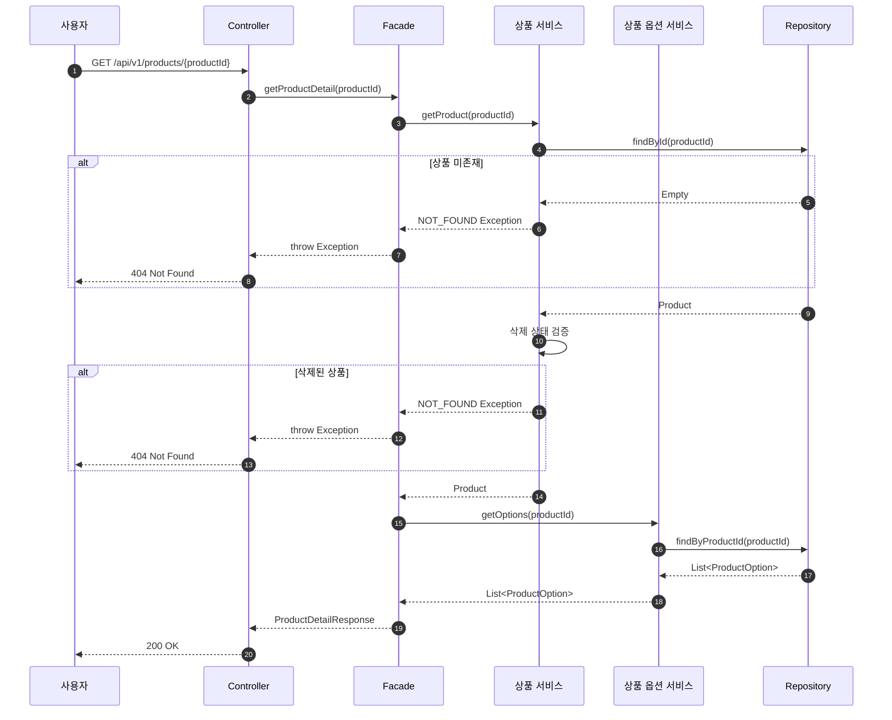
```mermaid
sequenceDiagram
    autonumber
    participant Client as 사용자
    participant Controller
    participant Facade
    participant ProductService as 상품 서비스
    participant ProductOptionService as 상품 옵션 서비스
    participant Repository

    Client->>Controller: GET /api/v1/products/{productId}
    Controller->>Facade: getProductDetail(productId)
    Facade->>ProductService: getProduct(productId)
    ProductService->>Repository: findById(productId)

    alt 상품 미존재
        Repository-->>ProductService: Empty
        ProductService-->>Facade: NOT_FOUND Exception
        Facade-->>Controller: throw Exception
        Controller-->>Client: 404 Not Found
    end

    Repository-->>ProductService: Product
    ProductService->>ProductService: 삭제 상태 검증

    alt 삭제된 상품
        ProductService-->>Facade: NOT_FOUND Exception
        Facade-->>Controller: throw Exception
        Controller-->>Client: 404 Not Found
    end

    ProductService-->>Facade: Product
    Facade->>ProductOptionService: getOptions(productId)
    ProductOptionService->>Repository: findByProductId(productId)
    Repository-->>ProductOptionService: List<ProductOption>
    ProductOptionService-->>Facade: List<ProductOption>
    Facade-->>Controller: ProductDetailResponse
    Controller-->>Client: 200 OK
```

---

## 브랜드 & 상품 ADMIN

### [등록된 브랜드 목록 조회]

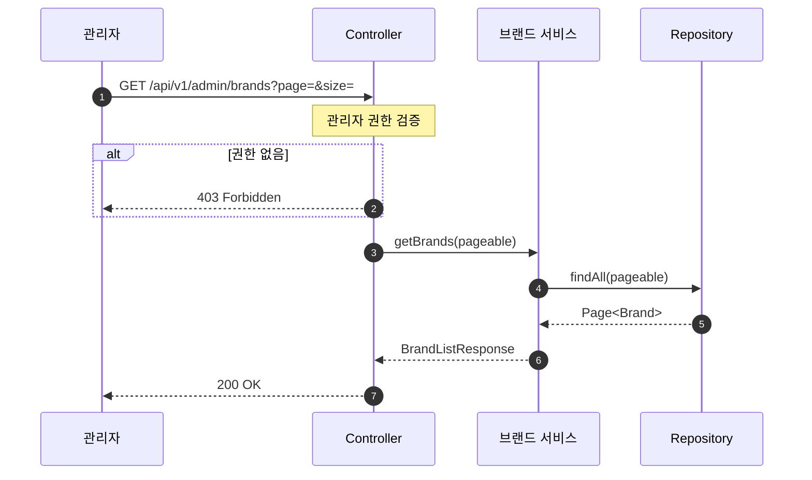
```mermaid
sequenceDiagram
    autonumber
    participant Admin as 관리자
    participant Controller
    participant Service as 브랜드 서비스
    participant Repository

    Admin->>Controller: GET /api/v1/admin/brands?page=&size=
    Note over Controller: 관리자 권한 검증

    alt 권한 없음
        Controller-->>Admin: 403 Forbidden
    end

    Controller->>Service: getBrands(pageable)
    Service->>Repository: findAll(pageable)
    Repository-->>Service: Page<Brand>
    Service-->>Controller: BrandListResponse
    Controller-->>Admin: 200 OK
```

### [브랜드 상세 조회 (ADMIN)]

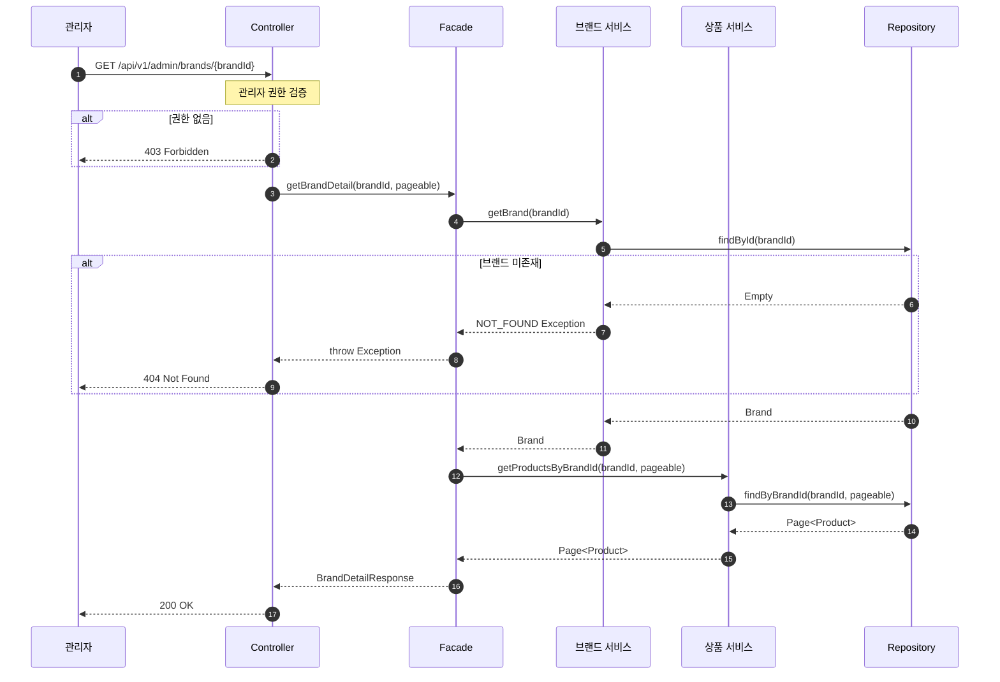
```mermaid
sequenceDiagram
    autonumber
    participant Admin as 관리자
    participant Controller
    participant Facade
    participant BrandService as 브랜드 서비스
    participant ProductService as 상품 서비스
    participant Repository

    Admin->>Controller: GET /api/v1/admin/brands/{brandId}
    Note over Controller: 관리자 권한 검증

    alt 권한 없음
        Controller-->>Admin: 403 Forbidden
    end

    Controller->>Facade: getBrandDetail(brandId, pageable)
    Facade->>BrandService: getBrand(brandId)
    BrandService->>Repository: findById(brandId)

    alt 브랜드 미존재
        Repository-->>BrandService: Empty
        BrandService-->>Facade: NOT_FOUND Exception
        Facade-->>Controller: throw Exception
        Controller-->>Admin: 404 Not Found
    end

    Repository-->>BrandService: Brand
    BrandService-->>Facade: Brand
    Facade->>ProductService: getProductsByBrandId(brandId, pageable)
    ProductService->>Repository: findByBrandId(brandId, pageable)
    Repository-->>ProductService: Page<Product>
    ProductService-->>Facade: Page<Product>
    Facade-->>Controller: BrandDetailResponse
    Controller-->>Admin: 200 OK
```

### [브랜드 등록]

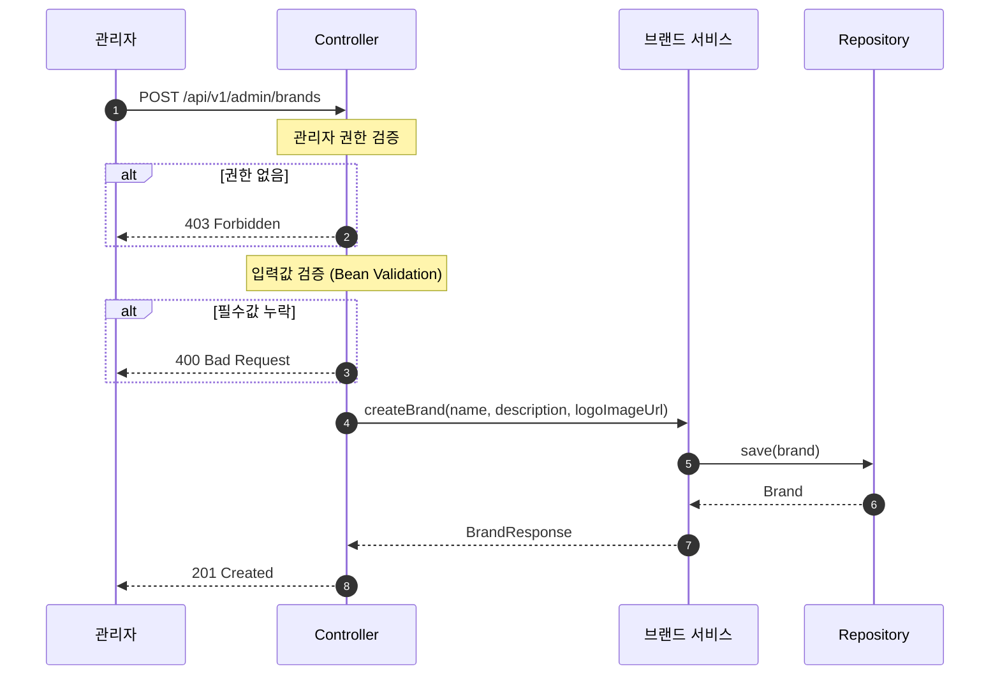
```mermaid
sequenceDiagram
    autonumber
    participant Admin as 관리자
    participant Controller
    participant BrandService as 브랜드 서비스
    participant Repository

    Admin->>Controller: POST /api/v1/admin/brands
    Note over Controller: 관리자 권한 검증

    alt 권한 없음
        Controller-->>Admin: 403 Forbidden
    end

    Note over Controller: 입력값 검증 (Bean Validation)

    alt 필수값 누락
        Controller-->>Admin: 400 Bad Request
    end

    Controller->>BrandService: createBrand(name, description, logoImageUrl)

    BrandService->>Repository: save(brand)
    Repository-->>BrandService: Brand
    BrandService-->>Controller: BrandResponse
    Controller-->>Admin: 201 Created
```

### [브랜드 정보 수정]

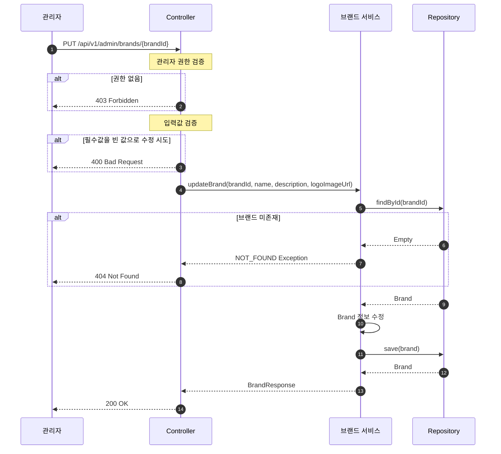
```mermaid
sequenceDiagram
    autonumber
    participant Admin as 관리자
    participant Controller
    participant BrandService as 브랜드 서비스
    participant Repository

    Admin->>Controller: PUT /api/v1/admin/brands/{brandId}
    Note over Controller: 관리자 권한 검증

    alt 권한 없음
        Controller-->>Admin: 403 Forbidden
    end

    Note over Controller: 입력값 검증

    alt 필수값을 빈 값으로 수정 시도
        Controller-->>Admin: 400 Bad Request
    end

    Controller->>BrandService: updateBrand(brandId, name, description, logoImageUrl)
    BrandService->>Repository: findById(brandId)

    alt 브랜드 미존재
        Repository-->>BrandService: Empty
        BrandService-->>Controller: NOT_FOUND Exception
        Controller-->>Admin: 404 Not Found
    end

    Repository-->>BrandService: Brand
    BrandService->>BrandService: Brand 정보 수정
    BrandService->>Repository: save(brand)
    Repository-->>BrandService: Brand
    BrandService-->>Controller: BrandResponse
    Controller-->>Admin: 200 OK
```

### [브랜드 삭제]

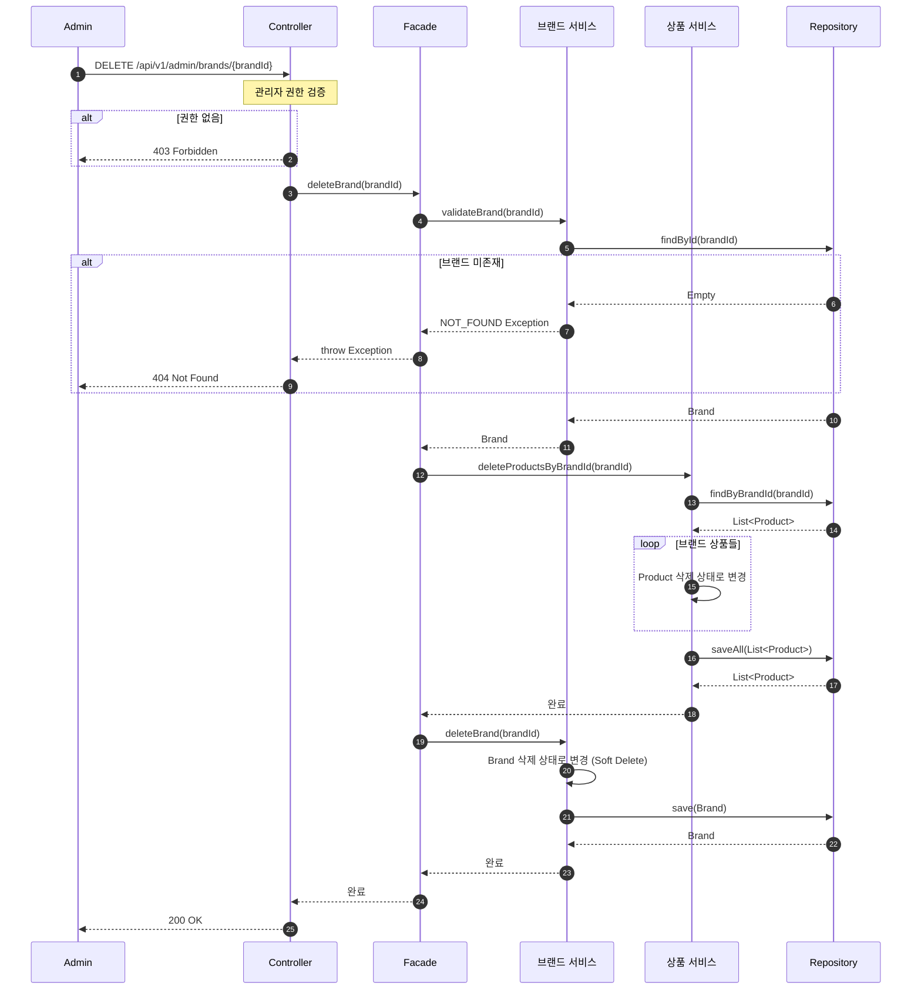
```mermaid
sequenceDiagram
    autonumber
    participant Admin
    participant Controller
    participant Facade
    participant BrandService as 브랜드 서비스
    participant ProductService as 상품 서비스
    participant Repository

    Admin->>Controller: DELETE /api/v1/admin/brands/{brandId}
    Note over Controller: 관리자 권한 검증

    alt 권한 없음
        Controller-->>Admin: 403 Forbidden
    end

    Controller->>Facade: deleteBrand(brandId)
    Facade->>BrandService: validateBrand(brandId)
    BrandService->>Repository: findById(brandId)

    alt 브랜드 미존재
        Repository-->>BrandService: Empty
        BrandService-->>Facade: NOT_FOUND Exception
        Facade-->>Controller: throw Exception
        Controller-->>Admin: 404 Not Found
    end

    Repository-->>BrandService: Brand
    BrandService-->>Facade: Brand

    Facade->>ProductService: deleteProductsByBrandId(brandId)
    ProductService->>Repository: findByBrandId(brandId)
    Repository-->>ProductService: List<Product>

    loop 브랜드 상품들
        ProductService->>ProductService: Product 삭제 상태로 변경
    end

    ProductService->>Repository: saveAll(List<Product>)
    Repository-->>ProductService: List<Product>
    ProductService-->>Facade: 완료

    Facade->>BrandService: deleteBrand(brandId)
    BrandService->>BrandService: Brand 삭제 상태로 변경 (Soft Delete)
    BrandService->>Repository: save(Brand)
    Repository-->>BrandService: Brand
    BrandService-->>Facade: 완료
    Facade-->>Controller: 완료
    Controller-->>Admin: 200 OK
```

### [상품 상세 조회 (ADMIN)]

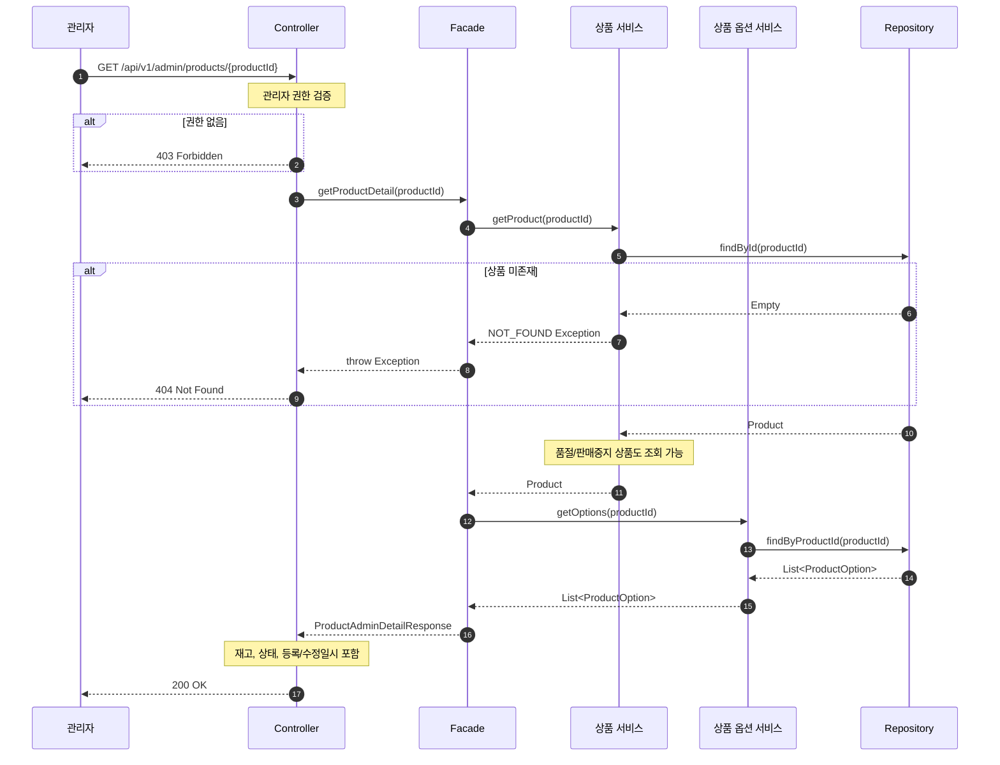
```mermaid
sequenceDiagram
    autonumber
    participant Admin as 관리자
    participant Controller
    participant Facade
    participant ProductService as 상품 서비스
    participant ProductOptionService as 상품 옵션 서비스
    participant Repository

    Admin->>Controller: GET /api/v1/admin/products/{productId}
    Note over Controller: 관리자 권한 검증

    alt 권한 없음
        Controller-->>Admin: 403 Forbidden
    end

    Controller->>Facade: getProductDetail(productId)
    Facade->>ProductService: getProduct(productId)
    ProductService->>Repository: findById(productId)

    alt 상품 미존재
        Repository-->>ProductService: Empty
        ProductService-->>Facade: NOT_FOUND Exception
        Facade-->>Controller: throw Exception
        Controller-->>Admin: 404 Not Found
    end

    Repository-->>ProductService: Product
    Note over ProductService: 품절/판매중지 상품도 조회 가능
    ProductService-->>Facade: Product
    Facade->>ProductOptionService: getOptions(productId)
    ProductOptionService->>Repository: findByProductId(productId)
    Repository-->>ProductOptionService: List<ProductOption>
    ProductOptionService-->>Facade: List<ProductOption>
    Facade-->>Controller: ProductAdminDetailResponse
    Note over Controller: 재고, 상태, 등록/수정일시 포함
    Controller-->>Admin: 200 OK
```

### [상품 등록]

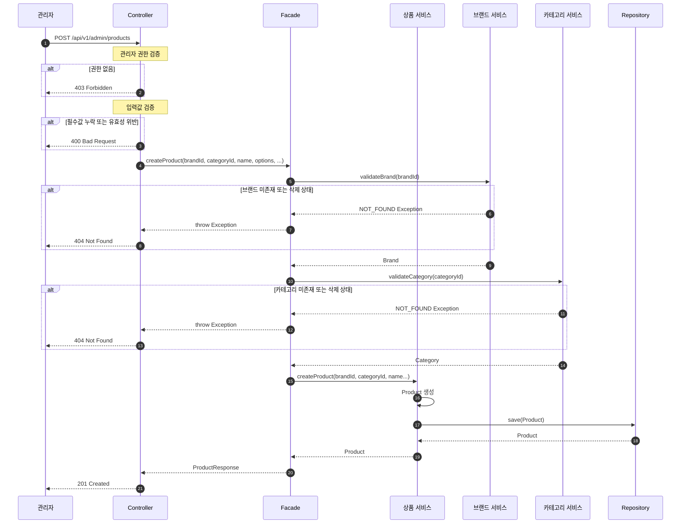
```mermaid
sequenceDiagram
    autonumber
    participant Admin as 관리자
    participant Controller
    participant Facade
    participant ProductService as 상품 서비스
    participant BrandService as 브랜드 서비스
    participant CategoryService as 카테고리 서비스
    participant Repository

    Admin->>Controller: POST /api/v1/admin/products
    Note over Controller: 관리자 권한 검증

    alt 권한 없음
        Controller-->>Admin: 403 Forbidden
    end

    Note over Controller: 입력값 검증

    alt 필수값 누락 또는 유효성 위반
        Controller-->>Admin: 400 Bad Request
    end

    Controller->>Facade: createProduct(brandId, categoryId, name, options, ...)
    Facade->>BrandService: validateBrand(brandId)

    alt 브랜드 미존재 또는 삭제 상태
        BrandService-->>Facade: NOT_FOUND Exception
        Facade-->>Controller: throw Exception
        Controller-->>Admin: 404 Not Found
    end

    BrandService-->>Facade: Brand

    Facade->>CategoryService: validateCategory(categoryId)


    alt 카테고리 미존재 또는 삭제 상태
        CategoryService-->>Facade: NOT_FOUND Exception
        Facade-->>Controller: throw Exception
        Controller-->>Admin: 404 Not Found
    end

    CategoryService-->>Facade: Category

    Facade->>ProductService: createProduct(brandId, categoryId, name...)
    ProductService->>ProductService: Product 생성
    ProductService->>Repository: save(Product)
    Repository-->>ProductService: Product
    ProductService-->>Facade: Product

    Facade-->>Controller: ProductResponse
    Controller-->>Admin: 201 Created
```

### [상품 정보 수정]

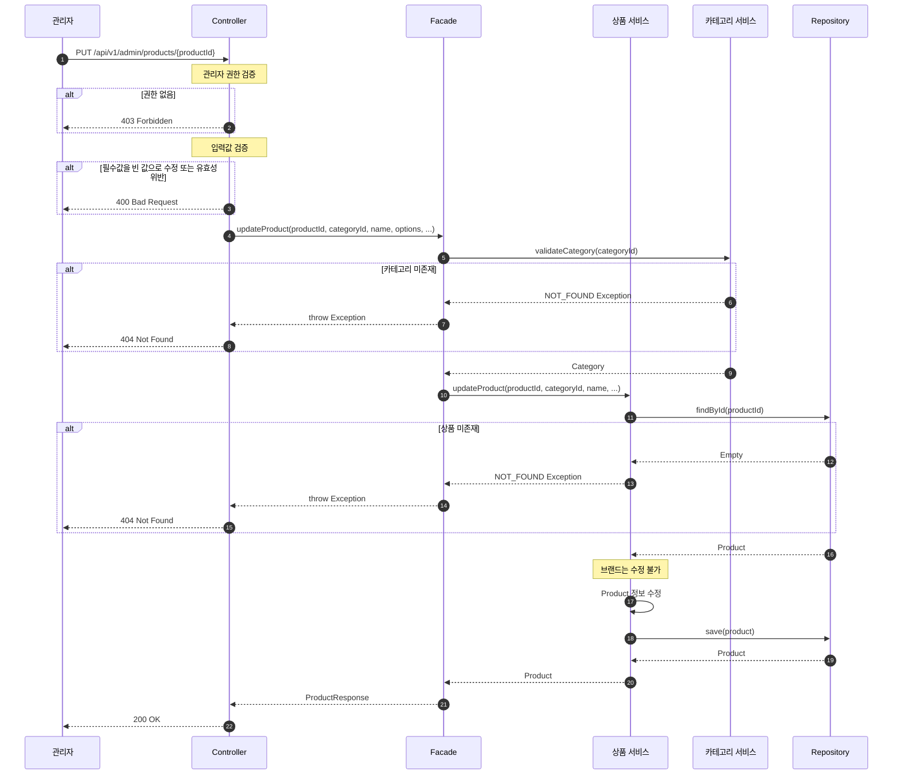
```mermaid
sequenceDiagram
    autonumber
    participant Admin as 관리자
    participant Controller
    participant Facade
    participant ProductService as 상품 서비스
    participant CategoryService as 카테고리 서비스
    participant Repository

    Admin->>Controller: PUT /api/v1/admin/products/{productId}
    Note over Controller: 관리자 권한 검증

    alt 권한 없음
        Controller-->>Admin: 403 Forbidden
    end

    Note over Controller: 입력값 검증

    alt 필수값을 빈 값으로 수정 또는 유효성 위반
        Controller-->>Admin: 400 Bad Request
    end

    Controller->>Facade: updateProduct(productId, categoryId, name, options, ...)

    Facade->>CategoryService: validateCategory(categoryId)

    alt 카테고리 미존재
        CategoryService-->>Facade: NOT_FOUND Exception
        Facade-->>Controller: throw Exception
        Controller-->>Admin: 404 Not Found
    end

    CategoryService-->>Facade: Category

    Facade->>ProductService: updateProduct(productId, categoryId, name, ...)
    ProductService->>Repository: findById(productId)

    alt 상품 미존재
        Repository-->>ProductService: Empty
        ProductService-->>Facade: NOT_FOUND Exception
        Facade-->>Controller: throw Exception
        Controller-->>Admin: 404 Not Found
    end

    Repository-->>ProductService: Product
    Note over ProductService: 브랜드는 수정 불가
    ProductService->>ProductService: Product 정보 수정
    ProductService->>Repository: save(product)
    Repository-->>ProductService: Product
    ProductService-->>Facade: Product

    Facade-->>Controller: ProductResponse
    Controller-->>Admin: 200 OK
```

### [상품 삭제]

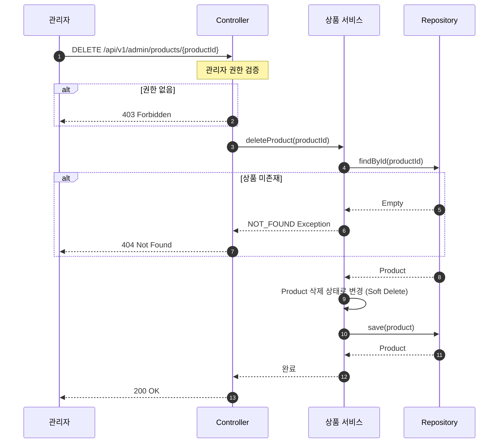
```mermaid
sequenceDiagram
    autonumber
    participant Admin as 관리자
    participant Controller
    participant ProductService as 상품 서비스
    participant Repository

    Admin->>Controller: DELETE /api/v1/admin/products/{productId}
    Note over Controller: 관리자 권한 검증

    alt 권한 없음
        Controller-->>Admin: 403 Forbidden
    end

    Controller->>ProductService: deleteProduct(productId)
    ProductService->>Repository: findById(productId)

    alt 상품 미존재
        Repository-->>ProductService: Empty
        ProductService-->>Controller: NOT_FOUND Exception
        Controller-->>Admin: 404 Not Found
    end

    Repository-->>ProductService: Product
    ProductService->>ProductService: Product 삭제 상태로 변경 (Soft Delete)
    ProductService->>Repository: save(product)
    Repository-->>ProductService: Product
    ProductService-->>Controller: 완료
    Controller-->>Admin: 200 OK
```

---

## 좋아요

### [상품 좋아요 등록/취소]

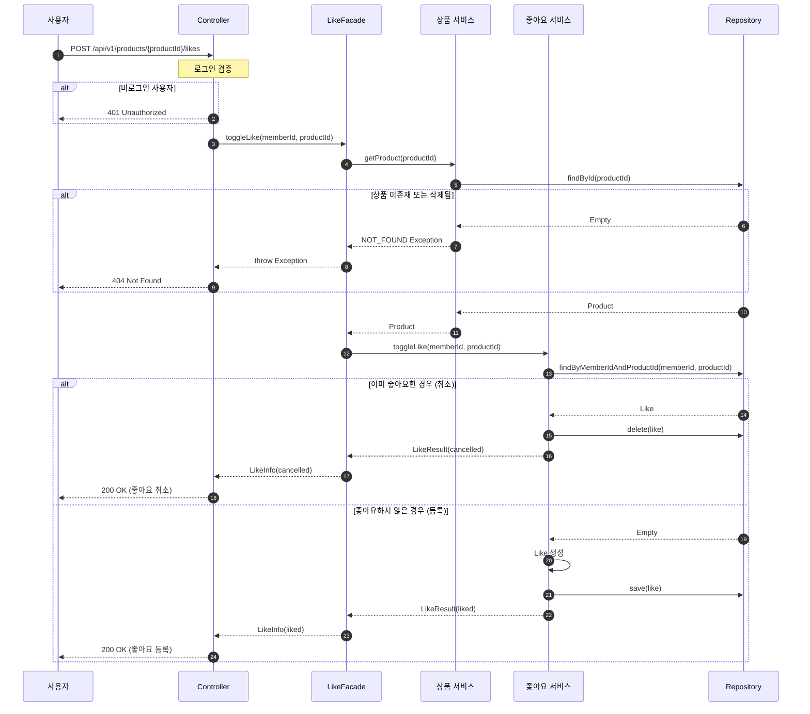
```mermaid
sequenceDiagram
    autonumber
    participant Client as 사용자
    participant Controller
    participant Facade as LikeFacade
    participant ProductService as 상품 서비스
    participant LikeService as 좋아요 서비스
    participant Repository

    Client->>Controller: POST /api/v1/products/{productId}/likes
    Note over Controller: 로그인 검증

    alt 비로그인 사용자
        Controller-->>Client: 401 Unauthorized
    end

    Controller->>Facade: toggleLike(memberId, productId)
    Facade->>ProductService: getProduct(productId)
    ProductService->>Repository: findById(productId)

    alt 상품 미존재 또는 삭제됨
        Repository-->>ProductService: Empty
        ProductService-->>Facade: NOT_FOUND Exception
        Facade-->>Controller: throw Exception
        Controller-->>Client: 404 Not Found
    end

    Repository-->>ProductService: Product
    ProductService-->>Facade: Product

    Facade->>LikeService: toggleLike(memberId, productId)
    LikeService->>Repository: findByMemberIdAndProductId(memberId, productId)

    alt 이미 좋아요한 경우 (취소)
        Repository-->>LikeService: Like
        LikeService->>Repository: delete(like)
        LikeService-->>Facade: LikeResult(cancelled)
        Facade-->>Controller: LikeInfo(cancelled)
        Controller-->>Client: 200 OK (좋아요 취소)
    else 좋아요하지 않은 경우 (등록)
        Repository-->>LikeService: Empty
        LikeService->>LikeService: Like 생성
        LikeService->>Repository: save(like)
        LikeService-->>Facade: LikeResult(liked)
        Facade-->>Controller: LikeInfo(liked)
        Controller-->>Client: 200 OK (좋아요 등록)
    end
```

---

## 주문

### [주문 요청]

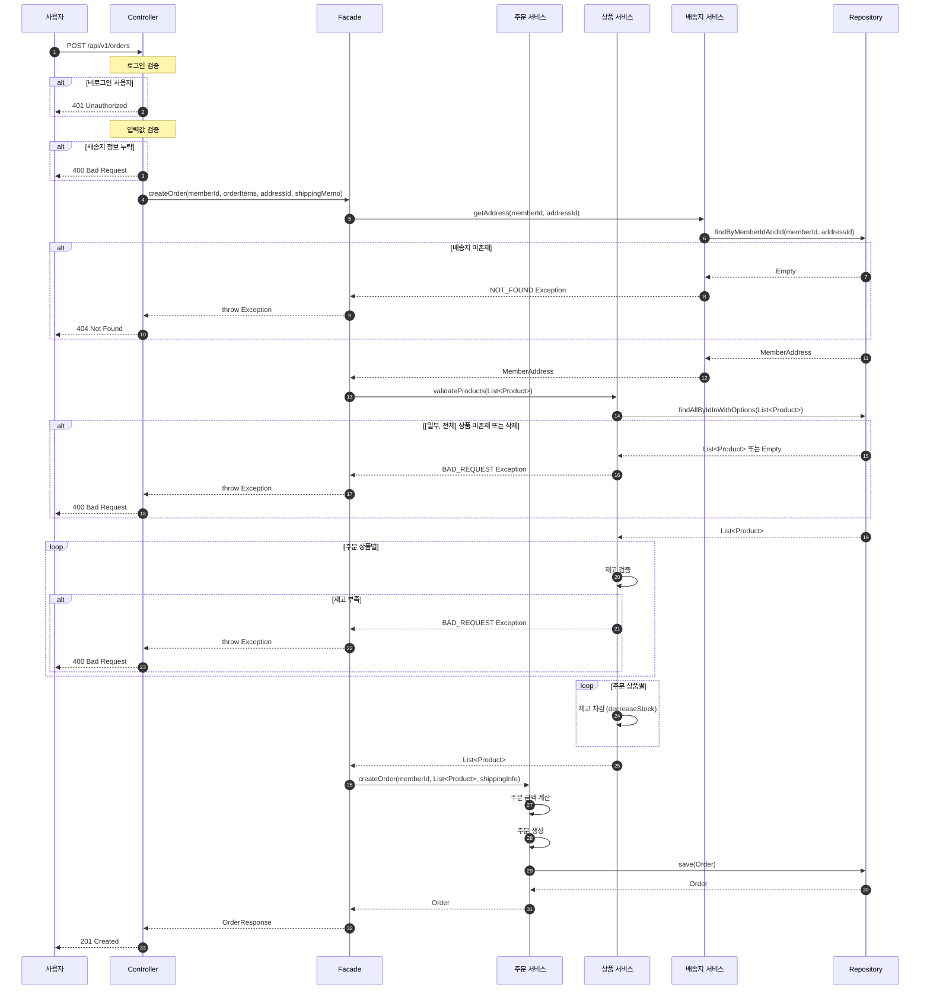
```mermaid
sequenceDiagram
    autonumber
    participant Client as 사용자
    participant Controller
    participant Facade
    participant OrderService as 주문 서비스
    participant ProductService as 상품 서비스
    participant MemberAddressService as 배송지 서비스
    participant Repository

    Client->>Controller: POST /api/v1/orders
    Note over Controller: 로그인 검증

    alt 비로그인 사용자
        Controller-->>Client: 401 Unauthorized
    end

    Note over Controller: 입력값 검증

    alt 배송지 정보 누락
        Controller-->>Client: 400 Bad Request
    end

    Controller->>Facade: createOrder(memberId, orderItems, addressId, shippingMemo)

    Facade->>MemberAddressService: getAddress(memberId, addressId)
    MemberAddressService->>Repository: findByMemberIdAndId(memberId, addressId)

    alt 배송지 미존재
        Repository-->>MemberAddressService: Empty
        MemberAddressService-->>Facade: NOT_FOUND Exception
        Facade-->>Controller: throw Exception
        Controller-->>Client: 404 Not Found
    end

    Repository-->>MemberAddressService: MemberAddress
    MemberAddressService-->>Facade: MemberAddress

    Facade->>ProductService: validateProducts(List<Product>)
    ProductService->>Repository: findAllByIdInWithOptions(List<Product>)

    alt [일부, 전체] 상품 미존재 또는 삭제
        Repository-->>ProductService: List<Product> 또는 Empty
        ProductService-->>Facade: BAD_REQUEST Exception
        Facade-->>Controller: throw Exception
        Controller-->>Client: 400 Bad Request
    end

    Repository-->>ProductService: List<Product>


    loop 주문 상품별
        ProductService->>ProductService: 재고 검증

        alt 재고 부족
            ProductService-->>Facade: BAD_REQUEST Exception
            Facade-->>Controller: throw Exception
            Controller-->>Client: 400 Bad Request
        end
    end

    loop 주문 상품별
        ProductService->>ProductService: 재고 차감 (decreaseStock)
    end

    ProductService-->>Facade: List<Product>

    Facade->>OrderService: createOrder(memberId, List<Product>, shippingInfo)


    OrderService->>OrderService: 주문 금액 계산
    OrderService->>OrderService: 주문 생성
    OrderService->>Repository: save(Order)
    Repository-->>OrderService: Order

    OrderService-->>Facade: Order
    Facade-->>Controller: OrderResponse
    Controller-->>Client: 201 Created
```

### [유저의 주문 목록 조회]

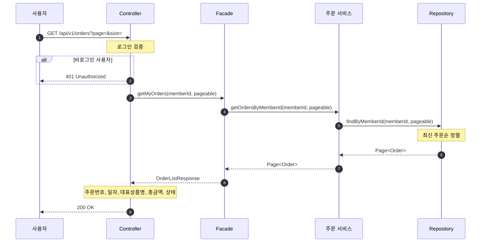
```mermaid
sequenceDiagram
    autonumber
    participant Client as 사용자
    participant Controller
    participant Facade
    participant OrderService as 주문 서비스
    participant Repository

    Client->>Controller: GET /api/v1/orders?page=&size=
    Note over Controller: 로그인 검증

    alt 비로그인 사용자
        Controller-->>Client: 401 Unauthorized
    end

    Controller->>Facade: getMyOrders(memberId, pageable)
    Facade->>OrderService: getOrdersByMemberId(memberId, pageable)
    OrderService->>Repository: findByMemberId(memberId, pageable)
    Note over Repository: 최신 주문순 정렬
    Repository-->>OrderService: Page<Order>
    OrderService-->>Facade: Page<Order>
    Facade-->>Controller: OrderListResponse
    Note over Controller: 주문번호, 일자, 대표상품명, 총금액, 상태
    Controller-->>Client: 200 OK
```

### [단일 주문 상세 조회]

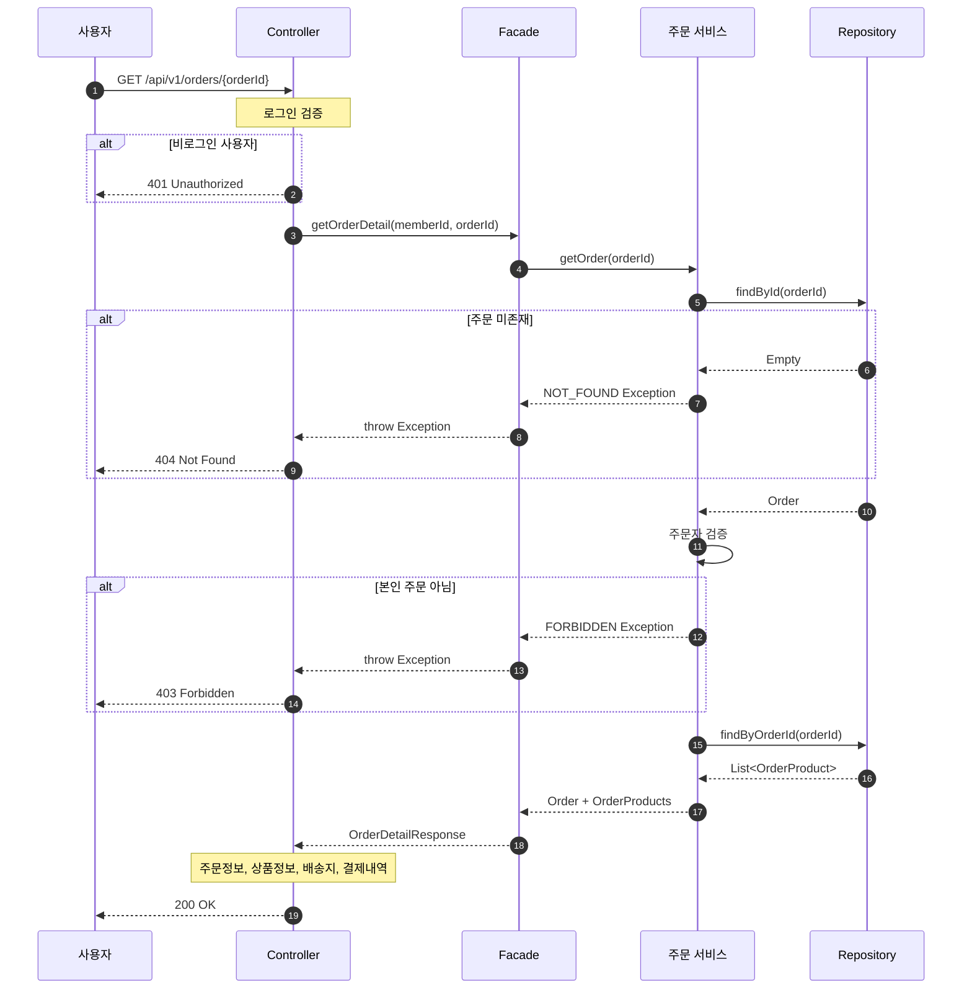
```mermaid
sequenceDiagram
    autonumber
    participant Client as 사용자
    participant Controller
    participant Facade
    participant OrderService as 주문 서비스
    participant Repository

    Client->>Controller: GET /api/v1/orders/{orderId}
    Note over Controller: 로그인 검증

    alt 비로그인 사용자
        Controller-->>Client: 401 Unauthorized
    end

    Controller->>Facade: getOrderDetail(memberId, orderId)
    Facade->>OrderService: getOrder(orderId)
    OrderService->>Repository: findById(orderId)

    alt 주문 미존재
        Repository-->>OrderService: Empty
        OrderService-->>Facade: NOT_FOUND Exception
        Facade-->>Controller: throw Exception
        Controller-->>Client: 404 Not Found
    end

    Repository-->>OrderService: Order
    OrderService->>OrderService: 주문자 검증

    alt 본인 주문 아님
        OrderService-->>Facade: FORBIDDEN Exception
        Facade-->>Controller: throw Exception
        Controller-->>Client: 403 Forbidden
    end

    OrderService->>Repository: findByOrderId(orderId)
    Repository-->>OrderService: List<OrderProduct>
    OrderService-->>Facade: Order + OrderProducts
    Facade-->>Controller: OrderDetailResponse
    Note over Controller: 주문정보, 상품정보, 배송지, 결제내역
    Controller-->>Client: 200 OK
```