# 클래스 다이어그램

> 💡 **레이어 구조**: `Interfaces(Controller) → Application(Facade) → Domain(Service, Entity) ← Infrastructure(Repository)`

---

## 전체 아키텍처 개요

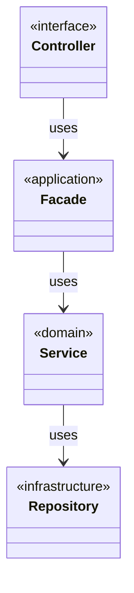

---

## 유저 (Member)

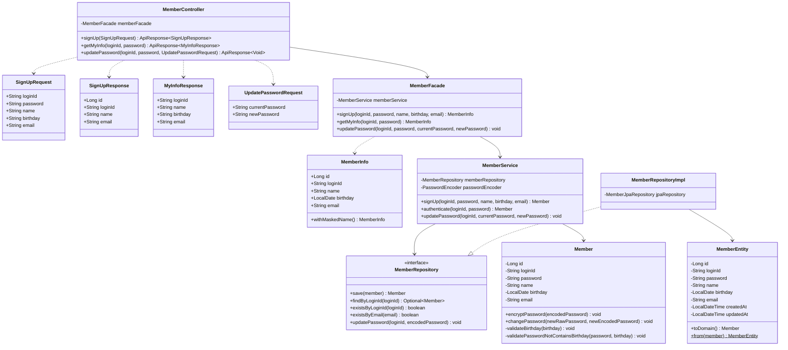

---

## 브랜드 (Brand)

### 왜 필요한가?

브랜드 도메인의 클래스 다이어그램으로 다음을 검증한다:
- **책임 분리**: 일반 사용자 API와 Admin API의 경계가 명확한가?
- **의존 방향**: Controller → Service/Facade → Repository 단방향 의존이 지켜지는가?
- **Facade 사용 기준**: 복합 로직(Brand + Product)에만 Facade를 사용하고 있는가?

### 클래스 다이어그램

```mermaid
classDiagram
    direction TB

    %% Interfaces Layer
    class BrandController {
        -BrandFacade brandFacade
        +getBrandInfo(brandId, pageable) ApiResponse~BrandInfoResponse~
    }

    class BrandAdminController {
        -BrandFacade brandFacade
        -BrandService brandService
        +getBrands(pageable) ApiResponse~Page~
        +getBrandDetail(brandId, pageable) ApiResponse~BrandDetailResponse~
        +createBrand(CreateBrandRequest) ApiResponse~BrandResponse~
        +updateBrand(brandId, UpdateBrandRequest) ApiResponse~BrandResponse~
        +deleteBrand(brandId) ApiResponse~Void~
    }

    class CreateBrandRequest {
        +String name
        +String description
        +String logoImageUrl
    }

    class UpdateBrandRequest {
        +String name
        +String description
        +String logoImageUrl
    }

    class BrandInfoResponse {
        +Long id
        +String name
        +String description
        +String logoImageUrl
        +Page~ProductInfo~ products
    }

    class BrandResponse {
        +Long id
        +String name
        +String description
        +String logoImageUrl
        +LocalDateTime createdAt
        +LocalDateTime updatedAt
    }

    class BrandDetailResponse {
        +Long id
        +String name
        +String description
        +String logoImageUrl
        +LocalDateTime createdAt
        +LocalDateTime updatedAt
        +LocalDateTime deletedAt
        +Page~ProductInfo~ products
    }

    %% Application Layer
    class BrandFacade {
        -BrandService brandService
        -ProductService productService
        +getBrandInfo(brandId, pageable) BrandInfo
        +getBrandDetail(brandId, pageable) BrandDetailInfo
        +deleteBrand(brandId) void
    }

    class BrandInfo {
        +Long id
        +String name
        +String description
        +String logoImageUrl
        +Page~ProductInfo~ products
    }

    class BrandDetailInfo {
        +Long id
        +String name
        +String description
        +String logoImageUrl
        +LocalDateTime createdAt
        +LocalDateTime updatedAt
        +LocalDateTime deletedAt
        +Page~ProductInfo~ products
    }

    %% Domain Layer
    class Brand {
        -Long id
        -String name
        -String description
        -String logoImageUrl
        -LocalDateTime createdAt
        -LocalDateTime updatedAt
        -LocalDateTime deletedAt
        +update(name, description, logoImageUrl) void
        +delete() void
        +isDeleted() boolean
    }

    class BrandService {
        -BrandRepository brandRepository
        +getBrand(brandId) Brand
        +getActiveBrand(brandId) Brand
        +getBrands(pageable) Page~Brand~
        +createBrand(name, description, logoImageUrl) Brand
        +updateBrand(brandId, name, description, logoImageUrl) Brand
        +deleteBrand(brandId) void
        +validateBrand(brandId) Brand
    }

    %% Infrastructure Layer
    class BrandRepository {
        <<interface>>
        +findById(brandId) Optional~Brand~
        +findAll(pageable) Page~Brand~
        +save(brand) Brand
        +existsById(brandId) boolean
    }

    class BrandRepositoryImpl {
        -BrandJpaRepository jpaRepository
    }

    class BrandEntity {
        -Long id
        -String name
        -String description
        -String logoImageUrl
        -LocalDateTime createdAt
        -LocalDateTime updatedAt
        -LocalDateTime deletedAt
        +toDomain() Brand
        +from(brand)$ BrandEntity
    }

    %% Relationships
    BrandController --> BrandFacade
    BrandAdminController --> BrandFacade
    BrandAdminController --> BrandService
    BrandFacade --> BrandService
    BrandFacade --> ProductService
    BrandFacade ..> BrandInfo
    BrandService --> BrandRepository
    BrandService --> Brand
    BrandRepositoryImpl ..|> BrandRepository
    BrandRepositoryImpl --> BrandEntity
```

### 핵심 포인트

1. **Facade 분기점**: `BrandAdminController`는 단순 CRUD(`getBrands`, `createBrand`, `updateBrand`)는 Service 직접 호출, 복합 로직(`getBrandDetail`, `deleteBrand`)은 Facade 경유
2. **Domain ↔ Entity 분리**: `Brand`(도메인)와 `BrandEntity`(영속성)를 분리하여 도메인 로직이 JPA에 의존하지 않음
3. **삭제 시 연쇄 처리**: `BrandFacade.deleteBrand()`는 `ProductService`를 호출하여 브랜드 소속 상품도 함께 삭제

### 잠재 리스크

| 리스크 | 영향 | 대안 |
|--------|------|------|
| **브랜드 삭제 트랜잭션 비대화** | 상품이 많으면 삭제 시간 증가, 락 경합 | 비동기 삭제 또는 배치 처리 검토 |
| **Facade 사용 기준 모호** | 개발자마다 판단 기준 다를 수 있음 | 팀 내 명확한 기준 문서화 필요 |
| **순환 의존 가능성** | ProductService가 BrandService를 참조하면 순환 발생 | Facade에서만 조합, Service 간 직접 참조 금지 |

---

## 카테고리 (Category)

### 왜 필요한가?

카테고리 도메인의 클래스 다이어그램으로 다음을 검증한다:
- **계층 구조 설계**: parentId, path, depth를 통한 트리 구조가 적절한가?
- **Admin 전용 CRUD**: 관리자만 카테고리를 생성/수정/삭제할 수 있는가?
- **삭제 정책**: 하위 카테고리나 상품이 존재할 때 삭제 처리는 어떻게 되는가?

### 클래스 다이어그램

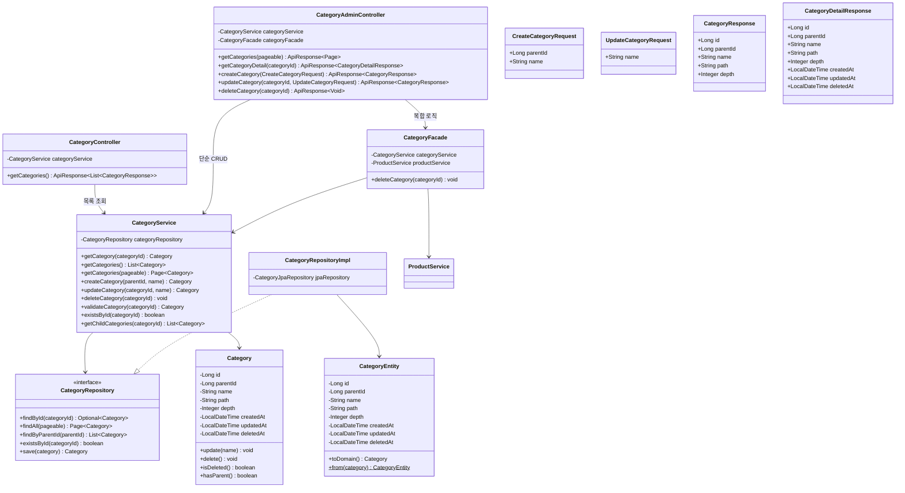

### 핵심 포인트

1. **사용자/Admin 분리**: `CategoryController`는 삭제되지 않은 카테고리 목록 조회만 제공, CRUD는 `CategoryAdminController`에서 관리자 전용으로 처리
2. **계층 구조**: `parentId`로 부모-자식 관계, `path`로 전체 경로, `depth`로 깊이 관리
3. **삭제 시 Facade 경유**: 하위 카테고리/상품 존재 여부 검증을 위해 `CategoryFacade.deleteCategory()` 사용

### 잠재 리스크

| 리스크 | 영향 | 대안 |
|--------|------|------|
| **연쇄 삭제 트랜잭션 비대화** | 하위 카테고리/상품이 많으면 삭제 시간 증가, 락 경합 | 비동기 삭제 또는 배치 처리 검토 |
| **path 갱신 복잡성** | 카테고리 이동 시 하위 모든 path 갱신 필요 | 현재는 카테고리 이동 미지원, 추후 고려 |

> **정책 결정 완료**: 카테고리 삭제 시 하위 카테고리 및 소속 상품 모두 연쇄 Soft Delete 처리 (CAT-012, CAT-013)

---

## 상품 (Product)

### 왜 필요한가?

상품 도메인의 클래스 다이어그램으로 다음을 검증한다:
- **Facade 사용 기준**: 다른 도메인 서비스 호출이 필요한 경우에만 Facade를 사용하는가?
- **도메인 경계 유지**: ProductService가 다른 도메인의 Repository를 직접 참조하지 않는가?
- **조회 시 검증 정책**: 존재하지 않는 카테고리 필터 시 404 Not Found 반환

### 클래스 다이어그램

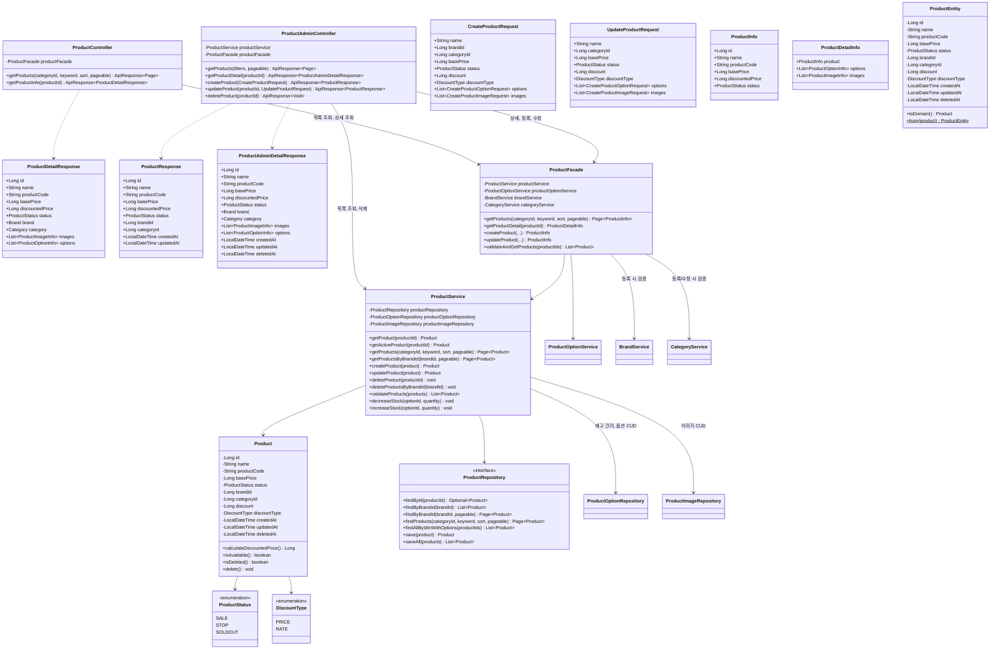

### 핵심 포인트

1. **Facade 사용 기준 명확화**
   - `getProducts()` → **Facade** (카테고리 존재 검증 포함)
   - `getProductDetail()` → **Facade** (Product + Option 조합)
   - `createProduct()` → **Facade** (Brand/Category 존재 검증)
   - `updateProduct()` → **Facade** (Category 변경 시 검증)
   - `deleteProduct()` → **Service** (Soft Delete, 단일 도메인)

2. **도메인 경계 유지**: ProductService는 ProductRepository와 ProductOptionRepository를 의존하여 상품 CRUD 및 재고 검증/차감을 담당하고, ProductOptionService는 조회 전용으로 Facade에서 상세 조회 시 옵션/이미지 조합에 사용. 다른 도메인(Brand, Category) 검증은 Facade에서 수행

3. **조회 정책**: 존재하지 않는 categoryId로 필터 시 404 Not Found 반환

### 잠재 리스크

| 리스크 | 영향 | 대안 |
|--------|------|------|
| **ProductFacade 의존성 (4개)** | 복잡도 증가, 테스트 어려움 | 등록/수정 전용 Facade 분리 검토 |
| **상품-옵션 일관성** | 상품 삭제 시 옵션도 삭제 필요 | Facade에서 옵션 삭제 처리 또는 CASCADE 설정 |
| **brandId 변경 불가 정책** | 요구사항에 명시되어 있으나 검증 로직 필요 | updateProduct에서 brandId 변경 시도 시 예외 |

---

## 상품 옵션 (Product Option)

### 왜 필요한가?

상품 옵션 도메인의 클래스 다이어그램으로 다음을 검증한다:
- **단순한 옵션 구조**: 옵션별로 추가 금액과 재고를 직접 관리하는가?
- **재고 관리 책임**: 옵션 단위 재고 관리가 명확한가?

### 클래스 다이어그램

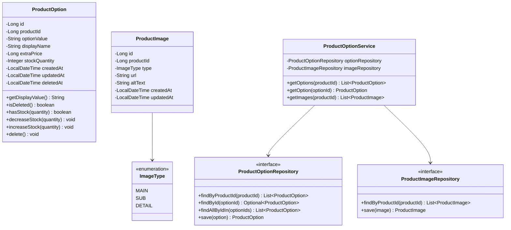

### 핵심 포인트

1. **옵션 = 판매 단위**: 각 옵션(예: RED, L)이 독립적인 추가 금액과 재고를 관리
2. **단순한 구조**: 옵션 그룹/SKU/매핑 테이블 없이 단일 `product_options` 테이블로 관리
3. **ProductFacade에서 조합 조회**: 상품 상세 조회 시 Product + Option + Image를 ProductFacade에서 조합

### 잠재 리스크

| 리스크 | 영향 | 대안 |
|--------|------|------|
| **재고 동시성 이슈** | 동시 주문 시 재고 차감 경합 | 비관적 락 또는 Redis 분산 락 적용 |
| **옵션 삭제 시 주문 데이터 정합성** | 삭제된 옵션을 참조하는 주문 존재 | Soft Delete + 주문에 스냅샷 데이터 저장 (현재 ERD에 반영됨) |
| **옵션 조합 미지원** | 색상+사이즈 조합별 재고 관리 불가 | 현재는 학습 프로젝트이므로 단일 옵션으로 충분 |

---

## 좋아요 (Like)

### 왜 필요한가?

좋아요 도메인의 클래스 다이어그램으로 다음을 검증한다:
- **토글 동작**: 좋아요 추가/취소가 단일 API로 처리되는가?
- **도메인 경계**: LikeService가 다른 도메인 Repository를 직접 참조하지 않는가?
- **다형성 지원**: 상품과 브랜드 좋아요가 동일한 도메인 로직으로 처리되는가?
- **대상 존재 검증**: 좋아요 대상의 존재 여부를 어디서, 어떻게 검증하는가?

### 클래스 다이어그램

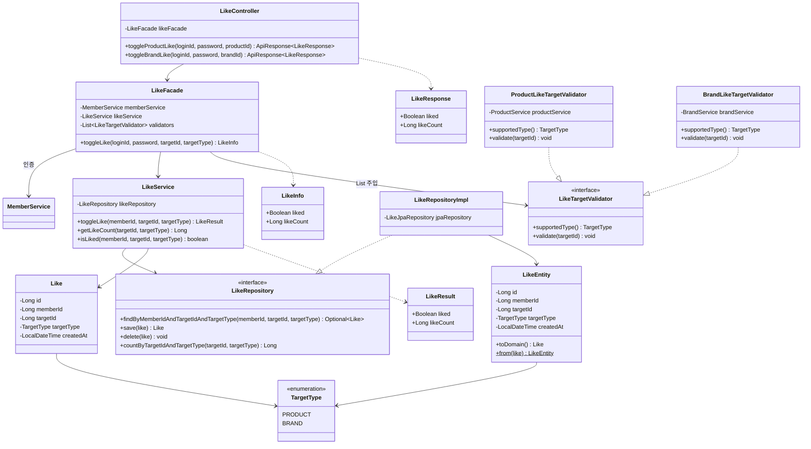

### 핵심 포인트

1. **LikeTargetValidator 전략 패턴**: 대상 존재 검증을 인터페이스로 추상화하여 OCP 준수. 새로운 좋아요 대상 추가 시 Validator 구현체만 추가하면 됨
2. **다형성 구조**: `target_id` + `target_type`으로 상품/브랜드 좋아요를 단일 테이블에서 관리
3. **토글 로직은 LikeService**: 좋아요 존재 여부 확인 → 있으면 삭제(하드 삭제), 없으면 생성
4. **RESTful 엔드포인트 분리**: `/products/{id}/likes`, `/brands/{id}/likes`로 리소스별 분리, 내부 로직은 통합

### 잠재 리스크

| 리스크 | 영향 | 대안 |
|--------|------|------|
| **동시 토글 요청** | 같은 사용자가 빠르게 중복 클릭 시 중복 좋아요 생성 가능 | UNIQUE 제약조건 (member_id, target_id, target_type) + 예외 처리 |
| **삭제된 대상 좋아요** | 대상 삭제 후 좋아요 데이터 잔존 | 대상 삭제 시 좋아요 연쇄 삭제 또는 조회 시 필터링 |
| **좋아요 카운트 성능** | 대상별 좋아요 수 매번 COUNT 쿼리 | 대상 테이블에 like_count 컬럼 추가 (비정규화) 또는 캐시 |

---

## 배송지 (MemberAddress)

### 왜 필요한가?

배송지 도메인의 클래스 다이어그램으로 다음을 검증한다:
- **배송지 재사용**: 회원이 자주 쓰는 배송지를 저장하고 재사용할 수 있는가?
- **기본 배송지**: 회원별 기본 배송지 설정이 가능한가?
- **주문 시 스냅샷**: 주문에는 배송지 정보가 복사(스냅샷)되어 저장되는가?

### 클래스 다이어그램

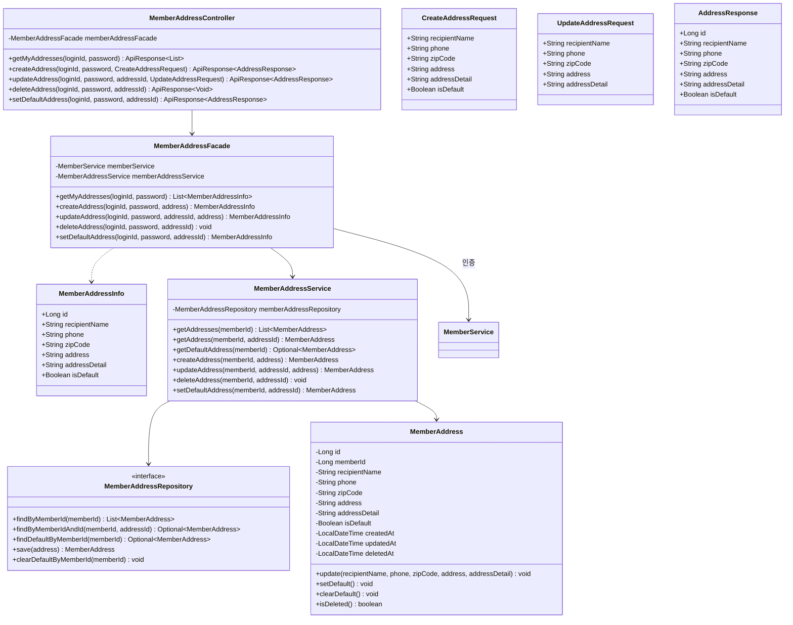

### 핵심 포인트

1. **회원별 배송지 목록**: 회원이 여러 배송지를 등록하고 관리 가능
2. **기본 배송지**: `isDefault=true`인 배송지는 회원당 1개, 주문 시 자동 선택
3. **주문과 분리**: 배송지 수정/삭제해도 기존 주문의 배송 정보에 영향 없음 (주문에 스냅샷 저장)

### 잠재 리스크

| 리스크 | 영향 | 대안 |
|--------|------|------|
| **기본 배송지 동시 변경** | 여러 요청으로 기본 배송지가 2개 이상 될 수 있음 | 트랜잭션 내 clearDefault → setDefault 순서 보장 |

> **정책 결정 완료**: 회원당 배송지 최대 5개 제한 (ADR-013)

---

## 주문 (Order)

### 왜 필요한가?

주문 도메인의 클래스 다이어그램으로 다음을 검증한다:
- **다중 도메인 협력**: 주문 생성 시 Product, 옵션 검증 및 재고 차감이 올바르게 조합되는가?
- **스냅샷 저장**: 주문 시점의 상품명/가격/배송정보가 스냅샷으로 저장되어 원본 변경에 영향받지 않는가?
- **상태 전이 규칙**: 주문 상태 변경 시 유효한 전이만 허용되는가?

### 클래스 다이어그램

```mermaid
classDiagram
    direction TB

    %% Interfaces Layer
    class OrderController {
        -OrderFacade orderFacade
        +createOrder(loginId, password, CreateOrderRequest) ApiResponse~OrderResponse~
        +getMyOrders(loginId, password, period, pageable) ApiResponse~Page~
        +getOrderDetail(loginId, password, orderId) ApiResponse~OrderDetailResponse~
        +cancelOrder(loginId, password, orderId) ApiResponse~OrderResponse~
    }

    class OrderAdminController {
        -OrderFacade orderFacade
        -OrderService orderService
        +getOrders(filters, pageable) ApiResponse~Page~
        +getOrderDetail(orderId) ApiResponse~OrderAdminDetailResponse~
        +updateOrderStatus(orderId, UpdateOrderStatusRequest) ApiResponse~OrderResponse~
    }

    class CreateOrderRequest {
        +List~OrderItemRequest~ items
        +Long addressId
        +String shippingMemo
    }

    class OrderItemRequest {
        +Long productId
        +Long productOptionId
        +Integer quantity
    }

    class UpdateOrderStatusRequest {
        +OrderStatus status
    }

    class OrderResponse {
        +Long id
        +String orderNumber
        +String orderName
        +Long paymentAmount
        +OrderStatus status
        +LocalDateTime createdAt
    }

    class OrderDetailResponse {
        +Long id
        +String orderNumber
        +String orderName
        +Long totalAmount
        +Long shippingFee
        +Long discountAmount
        +Long paymentAmount
        +OrderStatus status
        +List~OrderProductInfo~ products
        +ShippingInfoResponse shippingInfo
        +LocalDateTime createdAt
    }

    class ShippingInfoResponse {
        +String recipientName
        +String phone
        +String zipCode
        +String address
        +String addressDetail
        +String memo
    }

    class OrderAdminDetailResponse {
        +Long id
        +String orderNumber
        +String orderName
        +Long totalAmount
        +Long shippingFee
        +Long discountAmount
        +Long paymentAmount
        +OrderStatus status
        +List~OrderProductInfo~ products
        +ShippingInfoResponse shippingInfo
        +Long memberId
        +LocalDateTime createdAt
        +LocalDateTime updatedAt
    }

    %% Application Layer
    class OrderFacade {
        -MemberService memberService
        -OrderService orderService
        -ProductService productService
        -MemberAddressService memberAddressService
        +createOrder(loginId, password, items, addressId, shippingMemo) OrderInfo
        +getMyOrders(loginId, password, period, pageable) Page~OrderInfo~
        +getOrderDetail(loginId, password, orderId) OrderDetailInfo
        +cancelOrder(loginId, password, orderId) OrderInfo
        +updateOrderStatus(orderId, status) OrderInfo
    }

    class OrderInfo {
        +Long id
        +String orderNumber
        +String orderName
        +Long paymentAmount
        +OrderStatus status
        +LocalDateTime createdAt
    }

    class OrderDetailInfo {
        +OrderInfo order
        +List~OrderProductInfo~ products
        +ShippingInfo shippingInfo
    }

    class ShippingInfo {
        +String recipientName
        +String phone
        +String zipCode
        +String address
        +String addressDetail
        +String memo
    }

    %% Domain Layer
    class Order {
        -Long id
        -Long memberId
        -String orderNumber
        -String orderName
        -Long totalAmount
        -Long shippingFee
        -Long discountAmount
        -Long paymentAmount
        -OrderStatus status
        -String recipientName
        -String recipientPhone
        -String recipientZipCode
        -String recipientAddress
        -String recipientAddressDetail
        -String shippingMemo
        -LocalDateTime createdAt
        -LocalDateTime updatedAt
        +calculatePaymentAmount() Long
        +updateStatus(newStatus) void
        +canCancel() boolean
        +cancel() void
        +isOwner(memberId) boolean
    }

    class OrderStatus {
        <<enumeration>>
        PENDING
        PAID
        PREPARING
        SHIPPING
        DELIVERED
        CANCELLED
        RETURNED
        +canTransitionTo(newStatus) boolean
    }

    class OrderProduct {
        -Long id
        -Long orderId
        -Long productId
        -Long productOptionId
        -String productName
        -String optionValue
        -Long price
        -Long extraPrice
        -Integer quantity
        -OrderProductStatus status
        -LocalDateTime createdAt
        -LocalDateTime updatedAt
        +getTotalPrice() Long
        +cancel() void
    }

    class OrderProductStatus {
        <<enumeration>>
        NORMAL
        CANCEL_REQUESTED
        CANCELLED
        RETURN_REQUESTED
        RETURNED
    }

    class OrderPeriod {
        <<enumeration>>
        THREE_MONTHS
        SIX_MONTHS
        ONE_YEAR
        ALL
    }

    class OrderService {
        -OrderRepository orderRepository
        -OrderProductRepository orderProductRepository
        +createOrder(memberId, orderProducts, shippingSnapshot) Order
        +getOrder(orderId) Order
        +getOrdersByMemberId(memberId, period, pageable) Page~Order~
        +getOrders(filters, pageable) Page~Order~
        +getOrderProducts(orderId) List~OrderProduct~
        +updateOrderStatus(orderId, status) Order
        +cancelOrder(orderId) Order
        +validateOrderOwner(orderId, memberId) void
    }

    %% Infrastructure Layer
    class OrderRepository {
        <<interface>>
        +findById(orderId) Optional~Order~
        +findByMemberId(memberId, period, pageable) Page~Order~
        +findAll(filters, pageable) Page~Order~
        +save(order) Order
    }

    class OrderProductRepository {
        <<interface>>
        +findByOrderId(orderId) List~OrderProduct~
        +saveAll(orderProducts) List~OrderProduct~
    }

    %% Relationships
    OrderController --> OrderFacade
    OrderAdminController --> OrderFacade
    OrderAdminController --> OrderService : 목록 조회
    OrderFacade --> MemberService : 인증
    OrderFacade --> OrderService
    OrderFacade --> ProductService : 상품/옵션 검증, 재고 차감/복구
    OrderFacade --> MemberAddressService : 배송지 조회
    OrderService --> OrderRepository
    OrderService --> OrderProductRepository
    OrderService --> Order
    Order --> OrderStatus
    Order "1" --> "*" OrderProduct : contains
    OrderProduct --> OrderProductStatus
```

### 핵심 포인트

1. **Facade 필수**: 주문 생성은 반드시 `OrderFacade` 경유 (배송지 조회 → 옵션 검증/재고 차감 → 주문 생성)
2. **배송 정보 스냅샷**: `Order`에 `recipientName`, `recipientPhone`, `recipientAddress` 등이 직접 저장 (배송지 수정에 영향 없음)
3. **addressId로 배송지 선택**: 주문 시 `MemberAddressService`에서 배송지 조회 후 스냅샷 복사
4. **상태 전이 검증**: `OrderStatus.canTransitionTo()`로 유효한 상태 변경만 허용
5. **취소 시 재고 복구 통합**: 사용자 `cancelOrder()`와 관리자 `updateOrderStatus(CANCELLED)` 모두 `ProductService.increaseStock()`으로 재고 복구 처리

### 잠재 리스크

| 리스크 | 영향 | 대안 |
|--------|------|------|
| **재고 차감 동시성** | 동시 주문 시 재고 초과 판매 가능 | ProductService에서 비관적 락 또는 분산 락 적용 |
| **트랜잭션 범위 비대화** | 옵션 재고 차감 + 주문 생성이 하나의 트랜잭션 | 현재는 허용, 규모 커지면 Saga 패턴 검토 |
| **부분 취소 복잡성** | 여러 상품 중 일부만 취소 시 금액 재계산 | 현재는 전체 취소만 지원, 부분 취소는 추후 설계 |

---

## 공통 (Support)

### 왜 필요한가?

공통 모듈의 클래스 다이어그램으로 다음을 검증한다:
- **일관된 응답 포맷**: 모든 API가 동일한 `ApiResponse` 구조를 사용하는가?
- **에러 처리 체계**: `CoreException` + `ErrorType`으로 타입 기반 예외 처리가 가능한가?
- **공통 엔티티 패턴**: `BaseEntity`로 감사(audit) 필드와 소프트 삭제가 통일되는가?

### 클래스 다이어그램

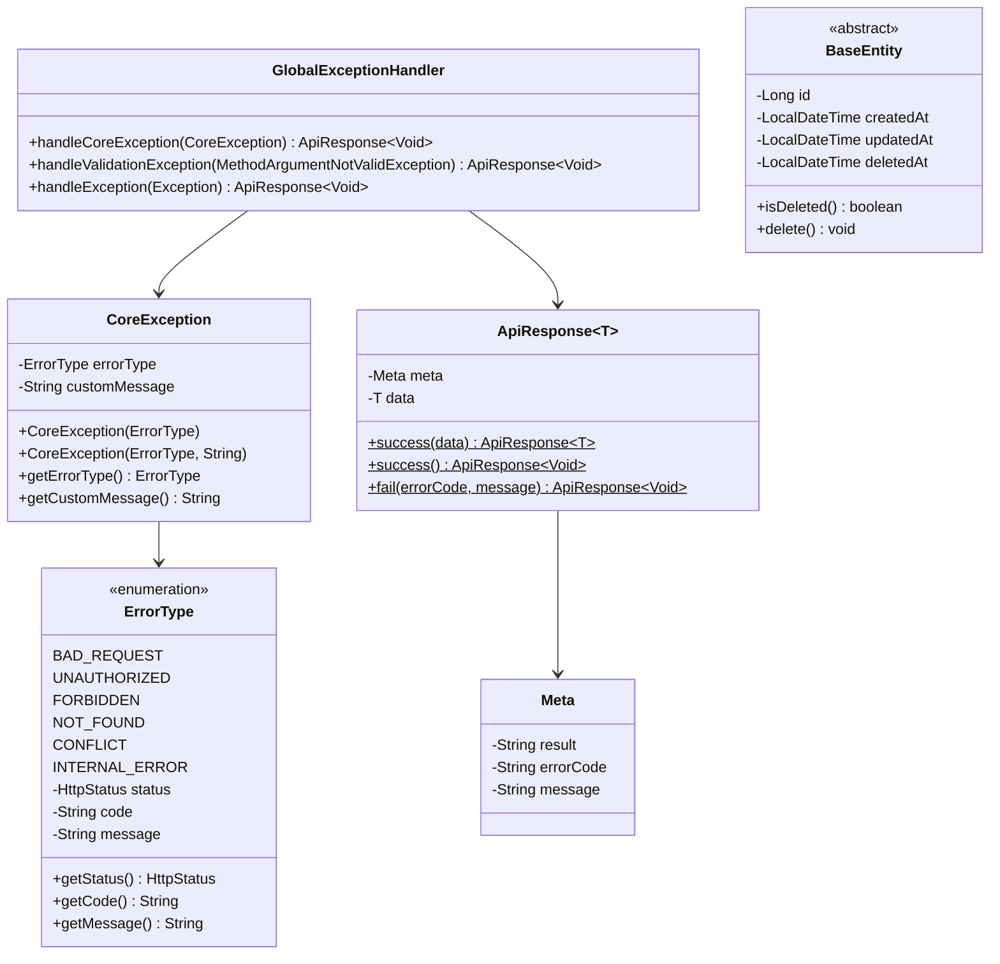

### 핵심 포인트

1. **ApiResponse 래핑**: 모든 응답은 `ApiResponse<T>`로 래핑, `meta.result`로 성공/실패 구분
2. **ErrorType 기반 예외**: `CoreException(ErrorType.NOT_FOUND)` 형태로 예외 발생, `GlobalExceptionHandler`에서 일괄 처리
3. **BaseEntity 상속**: 모든 Entity가 `id`, `createdAt`, `updatedAt`, `deletedAt` 공통 필드 상속

### 잠재 리스크

| 리스크 | 영향 | 대안 |
|--------|------|------|
| **ErrorType 확장 시 코드 중복** | 도메인별 세부 에러가 많아지면 ErrorType enum 비대화 | 도메인별 ErrorType 분리 또는 에러 코드 문자열 조합 방식 |
| **customMessage 남용** | 에러 메시지가 일관되지 않을 수 있음 | 기본 message 우선 사용, customMessage는 예외 상황에만 |
| **deletedAt null 체크 누락** | 소프트 삭제된 데이터 조회 가능 | Repository에서 `@Where(clause = "deleted_at IS NULL")` 적용 |

---

## 도메인 관계도

### 왜 필요한가?

전체 도메인 간 관계를 한눈에 파악하기 위한 조감도:
- **FK 관계 확인**: 각 도메인이 어떤 도메인을 참조하는가?
- **순환 의존 검증**: 도메인 간 순환 참조가 없는가?
- **결합도 파악**: 어떤 도메인이 가장 많은 의존을 받는가? (변경 시 영향 범위)

### 도메인 관계 다이어그램

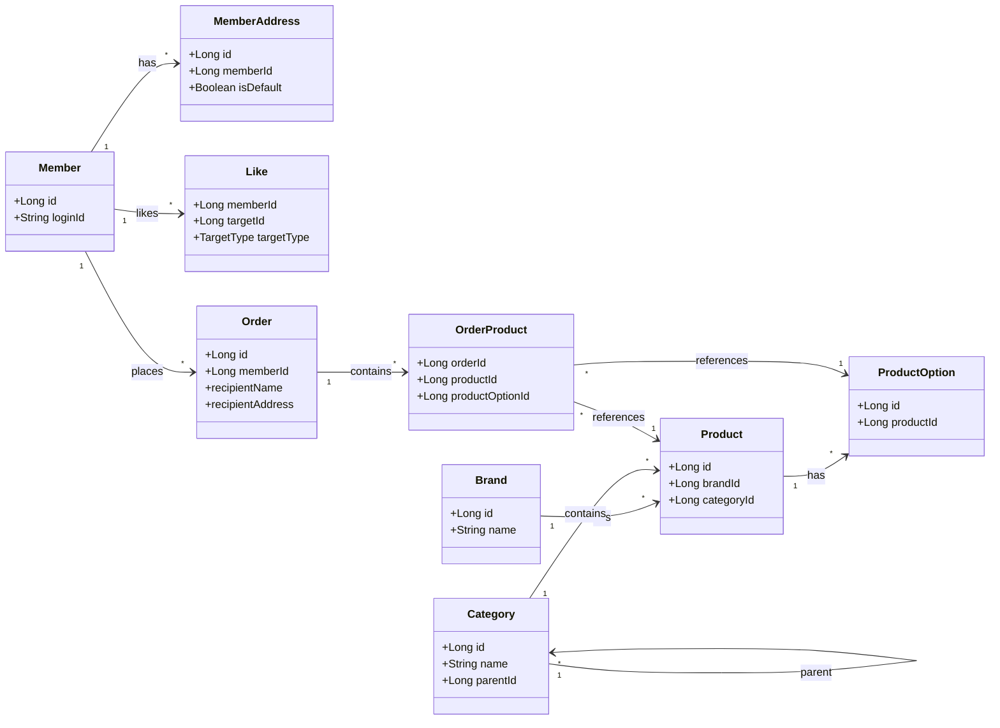

### 핵심 포인트

1. **Product가 중심 도메인**: Brand, Category, OrderProduct 등 가장 많은 참조를 받음 → 변경 시 영향 범위 큼
2. **Like 다형성 구조**: Like는 `targetId` + `targetType`으로 Product 또는 Brand를 참조하므로 직접 FK 없음
3. **순환 의존 없음**: 모든 화살표가 단방향, Category 자기 참조(parent)만 존재
4. **배송지 주소록 + 스냅샷**: `MemberAddress`는 회원의 배송지 목록, `Order`에는 주문 시점의 배송 정보가 스냅샷으로 저장

### 잠재 리스크

| 리스크 | 영향 | 대안 |
|--------|------|------|
| **Product 도메인 비대화** | Product 변경 시 여러 도메인에 영향 | 이벤트 기반 느슨한 결합 또는 인터페이스 분리 |
| **OrderProduct 스냅샷 의존** | Product/Option 삭제 시 참조 무결성 | Soft Delete 강제 + FK 제약조건 완화 |
| **Category 자기 참조 깊이** | 무한 깊이 허용 시 조회 성능 저하 | depth 제한 (예: 최대 3단계) 정책 |