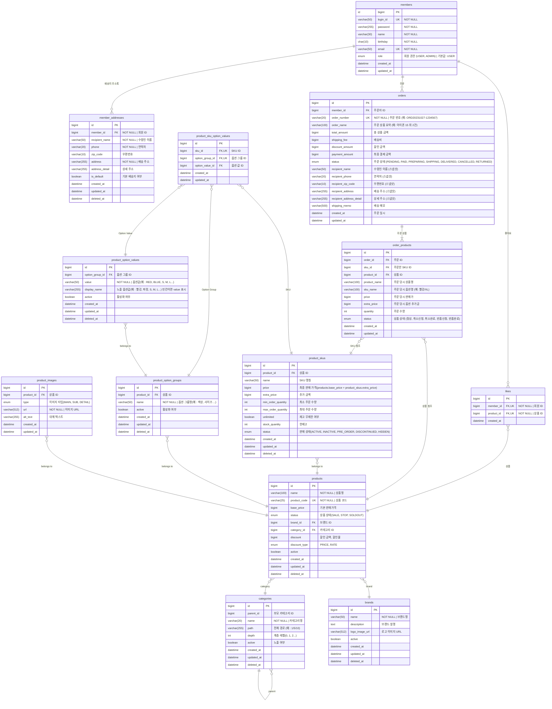

## ERDiagram

```mermaid
erDiagram

members {
id bigint PK
varchar(50) login_id UK "NOT NULL"
varchar(255) password "NOT NULL"
varchar(30) name "NOT NULL"
char(10) birthday "NOT NULL"
varchar(50) email UK "NOT NULL"
enum role "회원 권한 (USER, ADMIN) | 기본값: USER"
datetime created_at
datetime updated_at
}

member_addresses {
bigint id PK
bigint member_id FK "NOT NULL | 회원 ID"
varchar(50) recipient_name "NOT NULL | 수령인 이름"
varchar(20) phone "NOT NULL | 연락처"
varchar(10) zip_code "우편번호"
varchar(255) address "NOT NULL | 배송 주소"
varchar(255) address_detail "상세 주소"
boolean is_default "기본 배송지 여부"
datetime created_at
datetime updated_at
datetime deleted_at
}

products {
bigint id PK
varchar(100) name "NOT NULL | 상품명"
varchar(25) product_code UK "NOT NULL | 상품 코드"
bigint base_price "기본 판매가격"
enum status "상품 상태(SALE, STOP, SOLDOUT)"
bigint brand_id FK "브랜드 ID"
bigint category_id FK "카테고리 ID"
bigint discount "할인 금액, 할인율"
enum discount_type "PRICE, RATE"
boolean active
datetime created_at
datetime updated_at
datetime deleted_at
}

product_images {
bigint id PK
bigint product_id FK "상품 ID"
enum type "이미지 타입(MAIN, SUB, DETAIL)"
varchar(512) url "NOT NULL | 이미지 URL"
varchar(255) alt_text "대체 텍스트"
datetime created_at
datetime updated_at
}

product_option_groups {
bigint id PK
bigint product_id FK "상품 ID"
varchar(50) name "NOT NULL | 옵션 그룹명(예 : 색상, 사이즈 ...)"
boolean active "활성화 여부"
datetime created_at
datetime updated_at
datetime deleted_at
}

product_option_values {
bigint id PK
bigint option_group_id FK "옵션 그룹 ID"
varchar(50) value "NOT NULL | 옵션값(예 : RED, BLUE, S, M, L...)"
varchar(255) display_name "노출 옵션값(예 : 빨강, 파랑, S, M, L...) 빈칸이면 value 표시"
boolean active "활성화 여부"
datetime created_at
datetime updated_at
datetime deleted_at
}

product_skus {
bigint id PK
bigint product_id FK "상품 ID"
varchar(50) name "SKU 명칭"
bigint price "최종 판매 가격(products.base_price + product_skus.extra_price)"
bigint extra_price "추가 금액"
int min_order_quantity "최소 주문 수량"
int max_order_quantity "최대 주문 수량"
boolean unlimited "재고 무제한 여부"
int stock_quantity "현재고"
enum status "판매 상태(ACTIVE, INACTIVE, PRE_ORDER, DISCONTINUED, HIDDEN)"
datetime created_at
datetime updated_at
datetime deleted_at
}

product_sku_option_values {
bigint id PK
bigint sku_id FK,UK "SKU ID"
bigint option_group_id FK,UK "옵션 그룹 ID"
bigint option_value_id FK "옵션 값 ID"
datetime created_at
datetime updated_at
}


brands {
bigint id PK
varchar(50) name "NOT NULL | 브랜드명"
text description "브랜드 설명"
varchar(512) logo_image_url "로고 이미지 URL"
boolean active
datetime created_at
datetime updated_at
datetime deleted_at
}

categories {
bigint id PK
bigint parent_id "부모 카테고리 ID"
varchar(20) name "NOT NULL | 카테고리명"
varchar(255) path "전체 경로 (예 : 1/5/10)"
int depth "계층 레벨(0, 1, 2...)"
boolean active "노출 여부"
datetime created_at
datetime updated_at
datetime deleted_at
}

likes {
bigint id PK
bigint member_id FK,UK "NOT NULL | 회원 ID"
bigint product_id FK,UK "NOT NULL | 상품 ID"
datetime created_at
}

orders {
bigint id PK
bigint member_id FK "주문자 ID"
varchar(20) order_number UK "NOT NULL | 주문 번호 (예: ORD20231027-1234567)"
varchar(100) order_name "주문 상품 요약 (예: 아이폰 15 외 2건)"
bigint total_amount "총 상품 금액"
bigint shipping_fee "배송비"
bigint discount_amount "할인 금액"
bigint payment_amount "최종 결제 금액"
enum status "주문 상태 (PENDING, PAID, PREPARING, SHIPPING, DELIVERED, CANCELLED, RETURNED)"
varchar(50) recipient_name "수령인 이름 (스냅샷)"
varchar(20) recipient_phone "연락처 (스냅샷)"
varchar(10) recipient_zip_code "우편번호 (스냅샷)"
varchar(255) recipient_address "배송 주소 (스냅샷)"
varchar(255) recipient_address_detail "상세 주소 (스냅샷)"
varchar(500) shipping_memo "배송 메모"
datetime created_at "주문 일시"
datetime updated_at
}

order_products {
bigint id PK
bigint order_id FK "주문 ID"
bigint sku_id FK "주문한 SKU ID"
bigint product_id FK "상품 ID"
varchar(100) product_name "주문 당시 상품명"
varchar(100) sku_name "주문 당시 옵션명 (예: 빨강/XL)"
bigint price "주문 당시 판매가"
bigint extra_price "주문 당시 옵션 추가금"
int quantity "주문 수량"
enum status "상품 상태 (정상, 취소신청, 취소완료, 반품신청, 반품완료)"
datetime created_at
datetime updated_at
}

product_images }o--|| products : "belongs to"
product_option_groups }o--|| products : "belongs to"
product_option_values }o--|| product_option_groups : "belongs to"
product_skus }o--|| products : "belongs to"
product_sku_option_values }o--|| product_skus : "SKU"
product_sku_option_values }o--|| product_option_groups : "Option Group"
product_sku_option_values }o--|| product_option_values : "Option Value"
products }o--|| brands : "brand"
products }o--|| categories : "category"
categories }o--|| categories : "parent"
members ||--o{ likes: "좋아요"
likes }o--|| products: "상품"
members ||--o{ orders: "주문"
orders ||--|{ order_products: "주문 상품"
order_products }o--|| products: "상품 참조"
order_products }o--|| product_skus: "SKU 참조"
members ||--o{ member_addresses: "배송지 주소록"
```