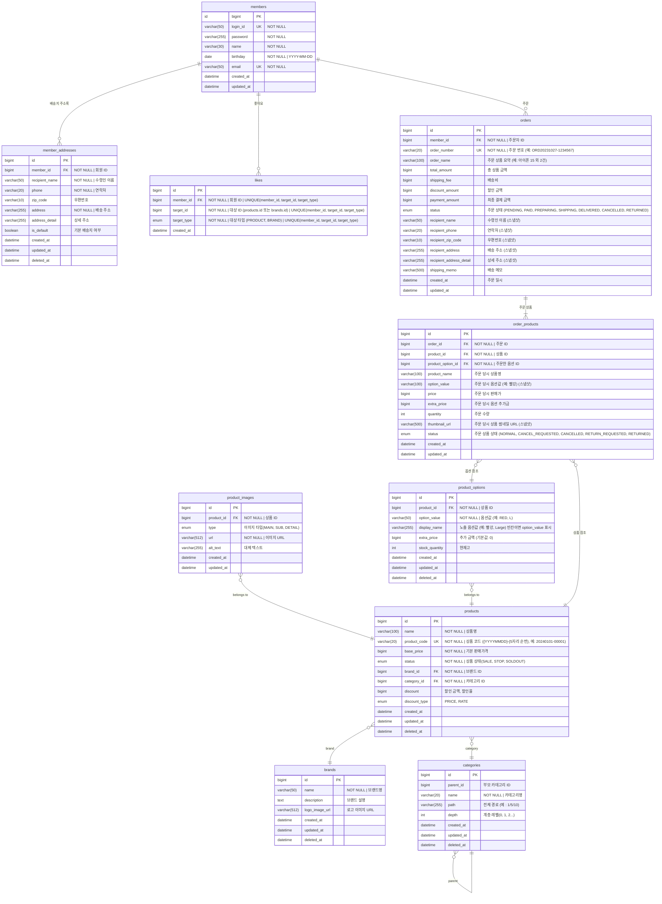

## ERDiagram

```mermaid
erDiagram

members {
id bigint PK
varchar(50) login_id UK "NOT NULL"
varchar(255) password "NOT NULL"
varchar(30) name "NOT NULL"
date birthday "NOT NULL | YYYY-MM-DD"
varchar(50) email UK "NOT NULL"
datetime created_at
datetime updated_at
}

member_addresses {
bigint id PK
bigint member_id FK "NOT NULL | 회원 ID"
varchar(50) recipient_name "NOT NULL | 수령인 이름"
varchar(20) phone "NOT NULL | 연락처"
varchar(10) zip_code "우편번호"
varchar(255) address "NOT NULL | 배송 주소"
varchar(255) address_detail "상세 주소"
boolean is_default "기본 배송지 여부"
datetime created_at
datetime updated_at
datetime deleted_at
}

products {
bigint id PK
varchar(100) name "NOT NULL | 상품명"
varchar(20) product_code UK "NOT NULL | 상품 코드 ({YYYYMMDD}-{5자리 순번}, 예: 20240101-00001)"
bigint base_price "NOT NULL | 기본 판매가격"
enum status "NOT NULL | 상품 상태(SALE, STOP, SOLDOUT)"
bigint brand_id FK "NOT NULL | 브랜드 ID"
bigint category_id FK "NOT NULL | 카테고리 ID"
bigint discount "할인 금액, 할인율"
enum discount_type "PRICE, RATE"
datetime created_at
datetime updated_at
datetime deleted_at
}

product_images {
bigint id PK
bigint product_id FK "NOT NULL | 상품 ID"
enum type "이미지 타입(MAIN, SUB, DETAIL)"
varchar(512) url "NOT NULL | 이미지 URL"
varchar(255) alt_text "대체 텍스트"
datetime created_at
datetime updated_at
}

product_options {
bigint id PK
bigint product_id FK "NOT NULL | 상품 ID"
varchar(50) option_value "NOT NULL | 옵션값 (예: RED, L)"
varchar(255) display_name "노출 옵션값 (예: 빨강, Large) 빈칸이면 option_value 표시"
bigint extra_price "추가 금액 (기본값: 0)"
int stock_quantity "현재고"
datetime created_at
datetime updated_at
datetime deleted_at
}


brands {
bigint id PK
varchar(50) name "NOT NULL | 브랜드명"
text description "브랜드 설명"
varchar(512) logo_image_url "로고 이미지 URL"
datetime created_at
datetime updated_at
datetime deleted_at
}

categories {
bigint id PK
bigint parent_id "부모 카테고리 ID"
varchar(20) name "NOT NULL | 카테고리명"
varchar(255) path "전체 경로 (예 : 1/5/10)"
int depth "계층 레벨(0, 1, 2...)"
datetime created_at
datetime updated_at
datetime deleted_at
}

likes {
bigint id PK
bigint member_id FK "NOT NULL | 회원 ID | UNIQUE(member_id, target_id, target_type)"
bigint target_id "NOT NULL | 대상 ID (products.id 또는 brands.id) | UNIQUE(member_id, target_id, target_type)"
enum target_type "NOT NULL | 대상 타입 (PRODUCT, BRAND) | UNIQUE(member_id, target_id, target_type)"
datetime created_at
}

orders {
bigint id PK
bigint member_id FK "NOT NULL | 주문자 ID"
varchar(20) order_number UK "NOT NULL | 주문 번호 (예: ORD20231027-1234567)"
varchar(100) order_name "주문 상품 요약 (예: 아이폰 15 외 2건)"
bigint total_amount "총 상품 금액"
bigint shipping_fee "배송비"
bigint discount_amount "할인 금액"
bigint payment_amount "최종 결제 금액"
enum status "주문 상태 (PENDING, PAID, PREPARING, SHIPPING, DELIVERED, CANCELLED, RETURNED)"
varchar(50) recipient_name "수령인 이름 (스냅샷)"
varchar(20) recipient_phone "연락처 (스냅샷)"
varchar(10) recipient_zip_code "우편번호 (스냅샷)"
varchar(255) recipient_address "배송 주소 (스냅샷)"
varchar(255) recipient_address_detail "상세 주소 (스냅샷)"
varchar(500) shipping_memo "배송 메모"
datetime created_at "주문 일시"
datetime updated_at
}

order_products {
bigint id PK
bigint order_id FK "NOT NULL | 주문 ID"
bigint product_id FK "NOT NULL | 상품 ID"
bigint product_option_id FK "NOT NULL | 주문한 옵션 ID"
varchar(100) product_name "주문 당시 상품명"
varchar(100) option_value "주문 당시 옵션값 (예: 빨강) (스냅샷)"
bigint price "주문 당시 판매가"
bigint extra_price "주문 당시 옵션 추가금"
int quantity "주문 수량"
varchar(500) thumbnail_url "주문 당시 상품 썸네일 URL (스냅샷)"
enum status "주문 상품 상태 (NORMAL, CANCEL_REQUESTED, CANCELLED, RETURN_REQUESTED, RETURNED)"
datetime created_at
datetime updated_at
}

product_images }o--|| products : "belongs to"
product_options }o--|| products : "belongs to"
products }o--|| brands : "brand"
products }o--|| categories : "category"
categories }o--|| categories : "parent"
members ||--o{ likes: "좋아요"
members ||--o{ orders: "주문"
orders ||--|{ order_products: "주문 상품"
order_products }o--|| products: "상품 참조"
order_products }o--|| product_options: "옵션 참조"
members ||--o{ member_addresses: "배송지 주소록"
```